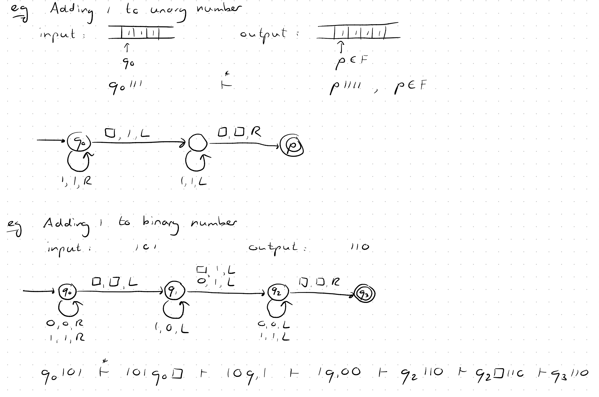
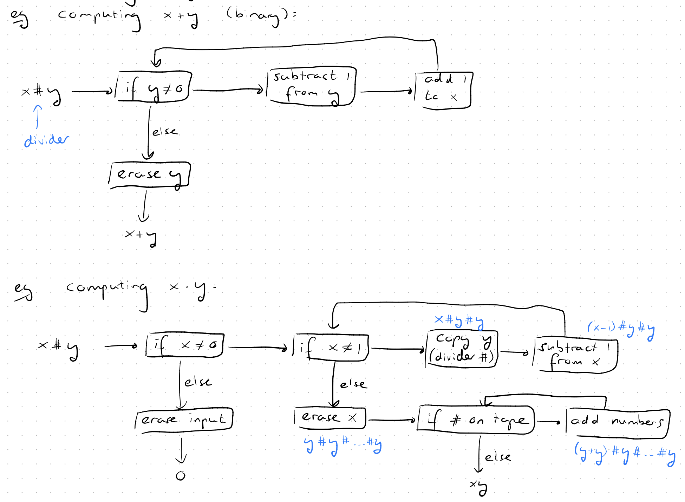
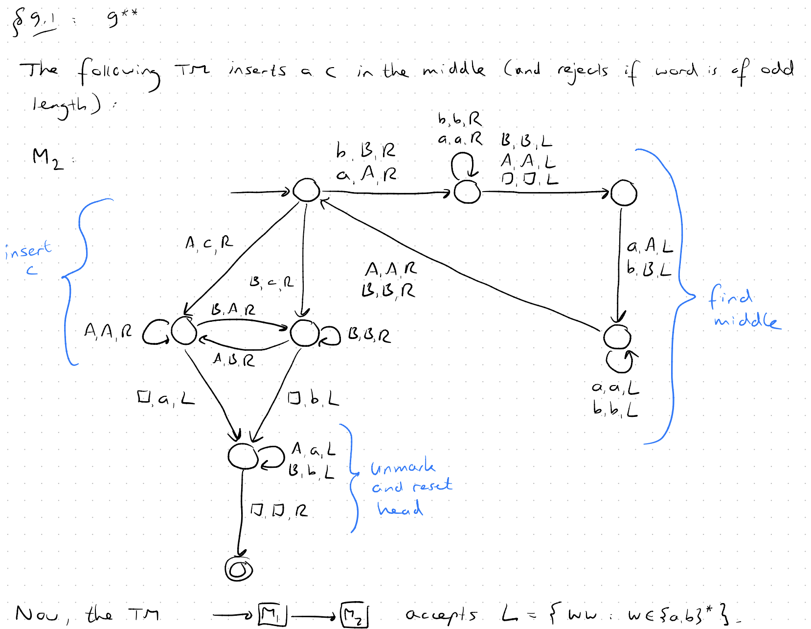
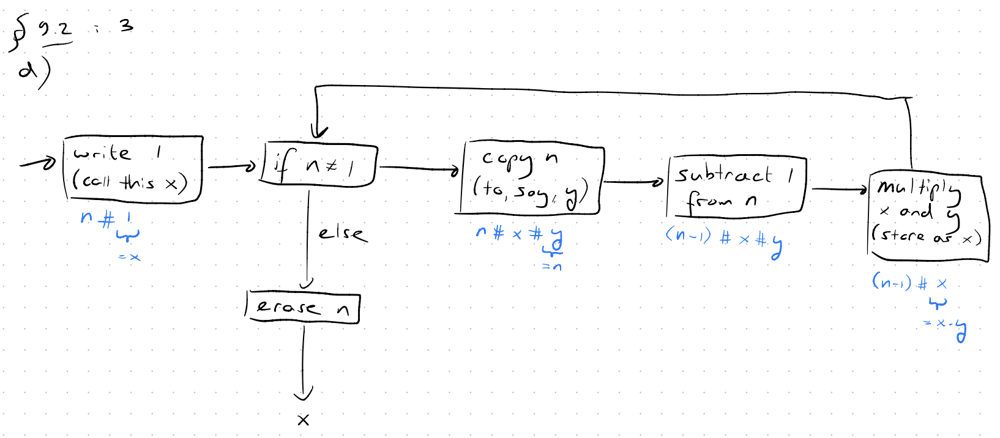

**Note**: In turing machine we are working on the tape so after replacements we should revert the head to the leftmost position of the tape and replace the changed symbols with the original ones.

---

### Arithmetic Operations on Turing Machines

**Excercise:** Look for division, power, OR, AND, NOT operations on Turing machines.

#### TM Types
- Deterministic Turing Machine (DTM)
    - Usually do BFS search on the state diagram.
- Deterministic Turing Machine with **stay** option (we can stay in the same cell instead of moving left or right)
- Deterministic Turing Machine with **multiple** option (we can have multiple tapes)
    - For each transition, we have to take care of all tapes.
    - No change to computational power.
- Non-deterministic Turing Machine
    - No change to computational power but make it easier to design TMs for some problems.
    - Can help with $L = \{ ww : w \in \{a,b\}^* \}$ as can guess the middle point and have multiple choises for a symbol.
- Universal Turing Machine
    - A Turing machine that can simulate an arbitrary Turing machine on arbitrary input.
    - A Turing Machine which loads another Turing Machine and its input on its tape and simulates it.
    - We have one internal state $q$ and 3 tapes:
        - Tape 1 - Description: Encoding of some Turing machine we are simulating (String with encoders and dividers: $\delta q_i a q_j b R$`)
        - Tape 2 - Tape Content: Contain content of the tape of the simulated Turing machine (Input string: `abab`)
        - Tape 3 - Internal State: Contain internal state of the simulated Turing machine (Tracking state of simulated TM: $q_0, q_1, \ldots$)

**Turing-Complete**: A system can run Universal Turing Machine.

---

#### Excercise

Construct a Turing machine that, given a word $w ∈ {a, b}^*$ of even length as input, inserts a c in the middle of the word, and ends its computation on the first space of the output. If w is of odd length, the machine should reject. Then, use this machine and the Turing machine that you constructed during previous tutorial accepting the language $L = \{ wcw^R : w ∈ {a, b}^* \}$ to construct a Turing machine accepting the language $L' = \{ ww^R : w ∈ {a, b}^* \}$.

#### Solution

#### Excercise

Using adders, subtracters, comparers, copiers, and/or multipliers, draw a block diagram for the Turing machine that computes the function $f(n) = n!$.

#### Solution

