### Transition Function

- $δ : Q × Σ → Q$: Takes a state and an input symbol, returning the next state. ($δ(A,0)=B$)
- $δ^* : Q × Σ^* → Q$: Takes a state and a string of input symbols, returning the resulting state after processing the entire string.($δ^*(A,"01")=B$)

**The language accepted by a DFA is**:

$L(M) = \{ w \in \Sigma^* : \delta^*(q_0, w) \in F \}$ where $F$ is the set of accepting states and $M$ is the DFA.

- A language $L$ is called **Regular Language** if and only if there exists some deterministic finite automaton $M$ such that $L = L(M)$.

**The language accepted by an NFA is**:

$L(N) = \{ w \in \Sigma^* : \delta^*(q_0, w) \cap F \neq \emptyset \}$ where $F$ is the set of accepting states and $N$ is the NFA 
---

## Deterministic Finite Automaton (DFA)
- Every state has exactly one transition for each symbol in the alphabet.
- No ε (epsilon) transitions are allowed.
- There should be no ambiguity in state transitions.

## Nondeterministic Finite Automaton (NFA)
- A state can have zero, one, or multiple transitions for each symbol in the alphabet.
- $ε$ ($\lambda$) transitions are allowed, meaning the automaton can change states without consuming any input symbol.
- There can be multiple possible next states for a given state and input symbol. ($δ(A,0)=\{B,C\}$)

- Every DFA is also an NFA, but not every NFA is a DFA.

---

### Lambda Transitions

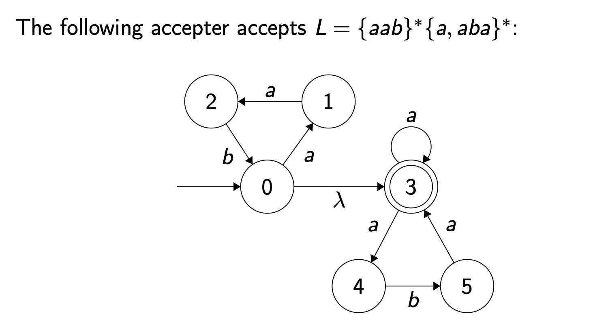

### Equivalence of DFA and NFA

- For every NFA, there exists an equivalent DFA that accepts the same language.

---

#### Exercise

- Construct an nfa with three states that accepts the language $\{ab,abc\}^*$

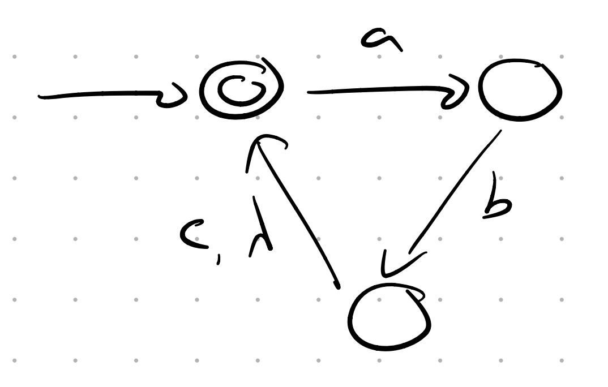

- Convert the following nfa’s into equivalent dfa’s.

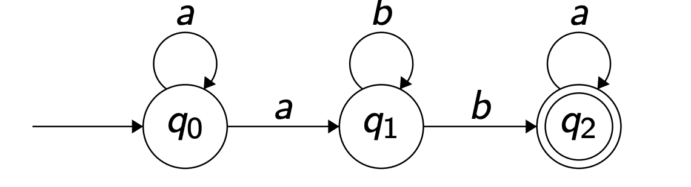  

- Solution: Use transition table method for NFA then for $\phi$ make a trap state

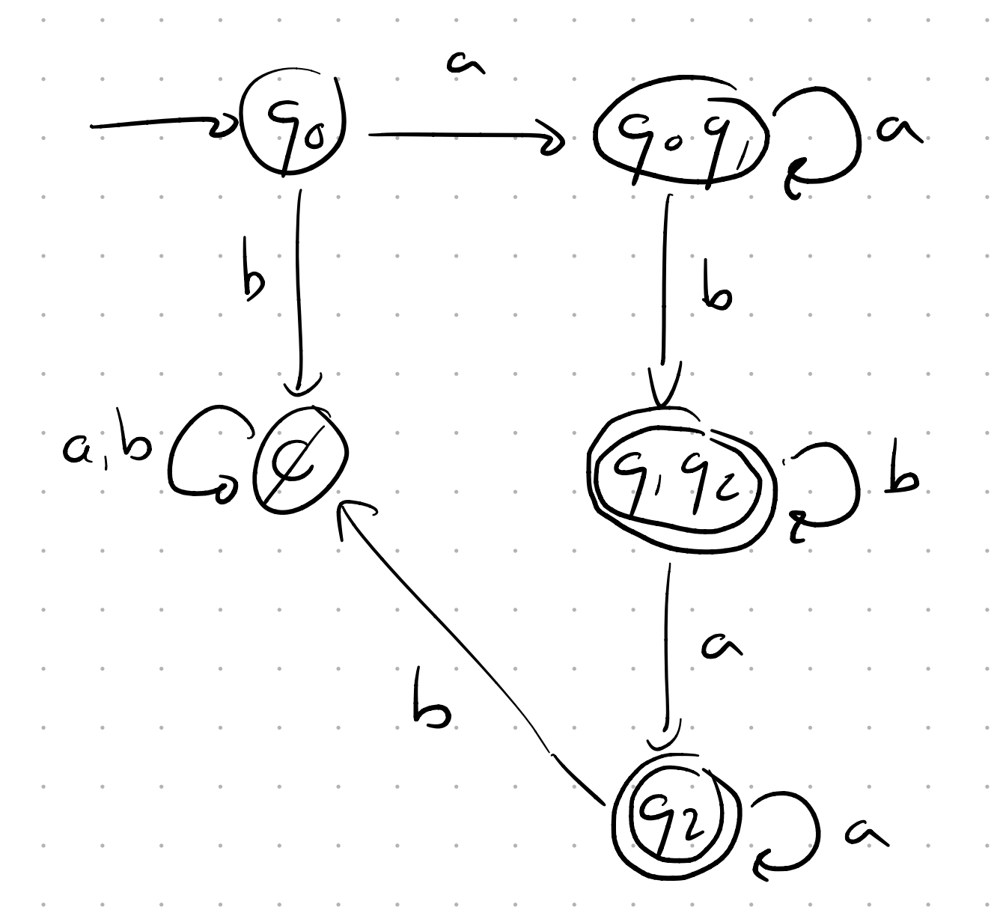

---

### Subset Construction Method

- We make transition table for NFA
- We start from 0, then it gives {1,2}
- Then we keep going from {1,2} and will get to mutual and individual states till we finish

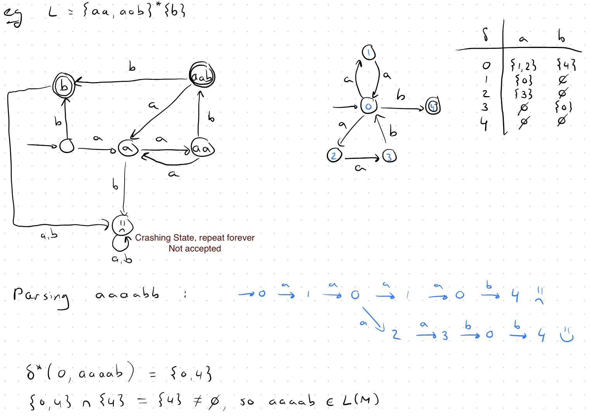  

Q:

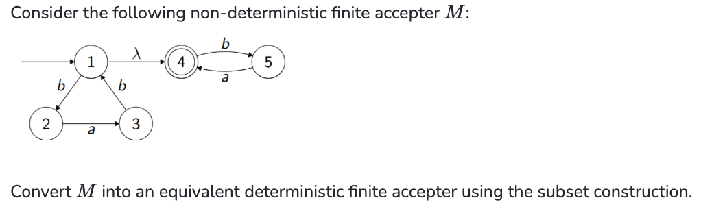

A:

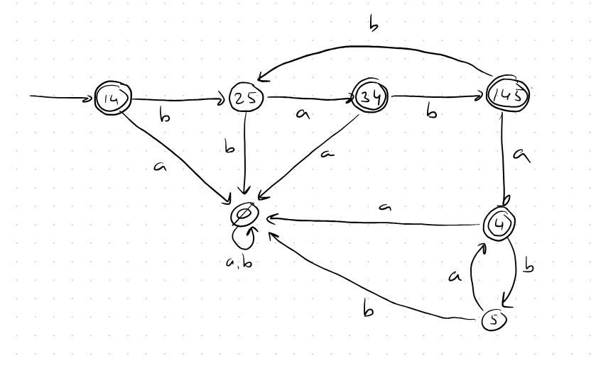
#### On the fly method

- We start with 1, it will take me to 4 if i don't do anything so First state is {1,4}
- From {1,4} if I give a, for 1 I will go to trash state (C) and for 4 I will go to C, from {1,4} with b I will go to 2 from 1 and to 5 from 4 so {2,5}
- From {2,5} with a I will go to 3 from 2 and 4 from 5 so {3,4}Final State because of 4, From {2,5} with b I will go to C from 2 and 5
- From {3,4} with a I will go to C, and for b I will go to 1 because of 3 also 4 with lambda and from 4 I will go to 5 so {1,4,5} Final State
- From {1,4,5} with a I will go to C from 1,4 but 4 because of 5 so {4}Final State, with b I will go to 2 because of 1 and 5 because of 4 so {2,5} which exists
- From {4} with a I will go to C, to {5} with b
- From {5} with a I will go to {4} Final State, with b to C

#### Complete Example

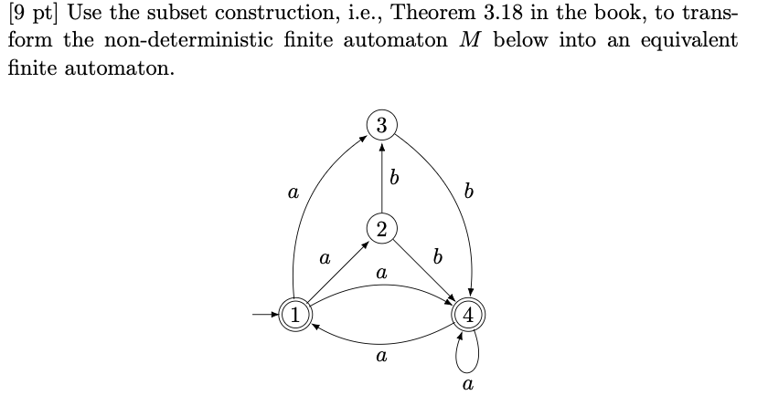

#### Answer

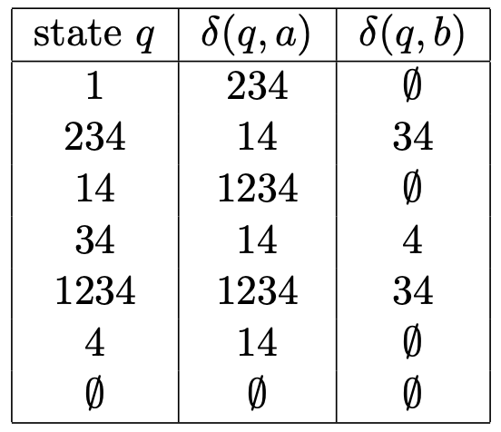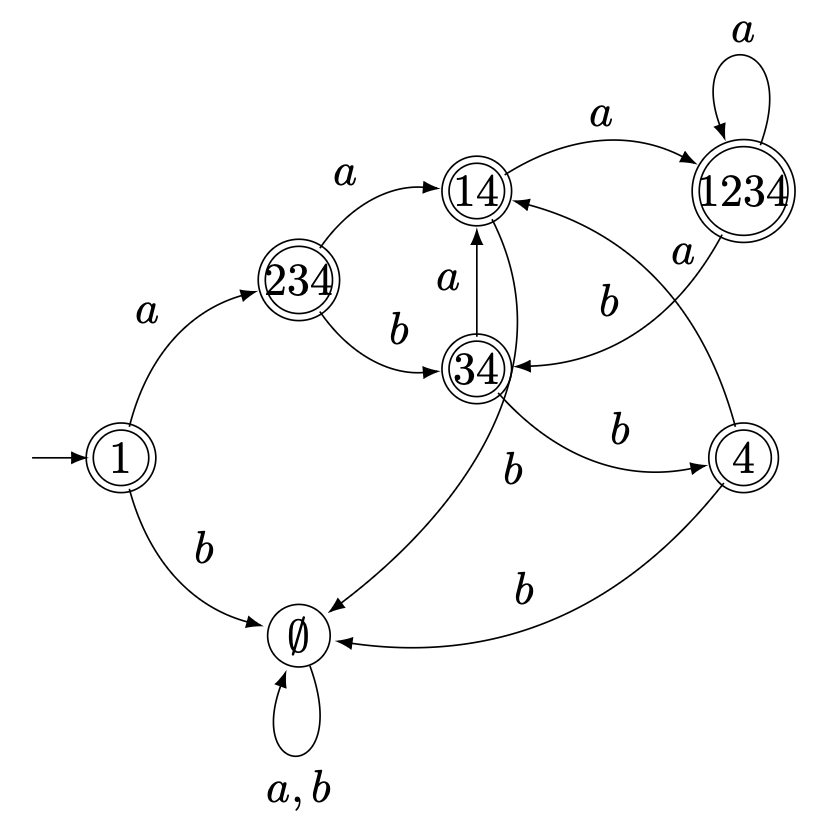

---

### Choose at the beginning
e.g. : $L = \{a, b\}^* \cup \{a, c\}^* \cup \{b, c\}^*$

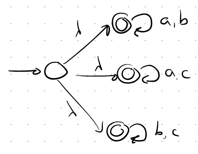