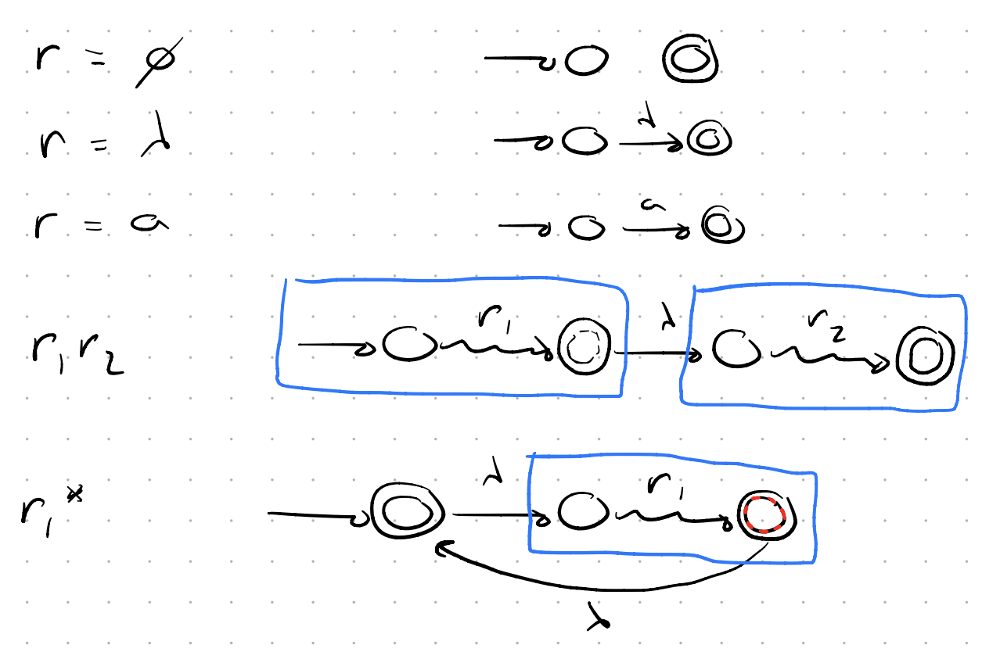
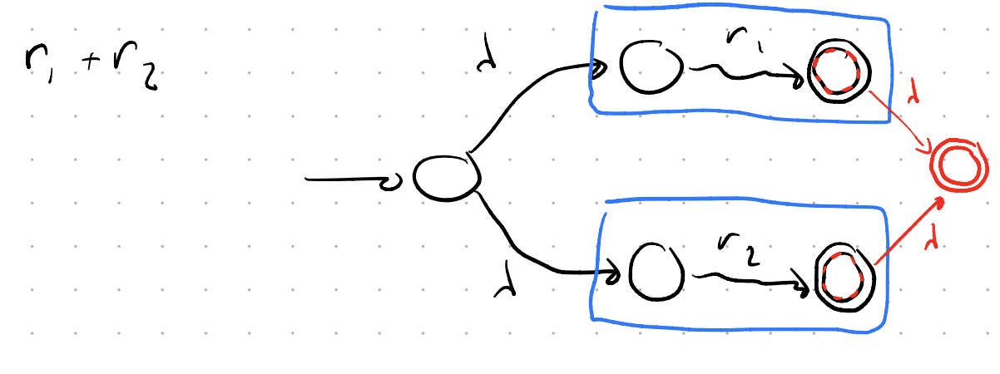
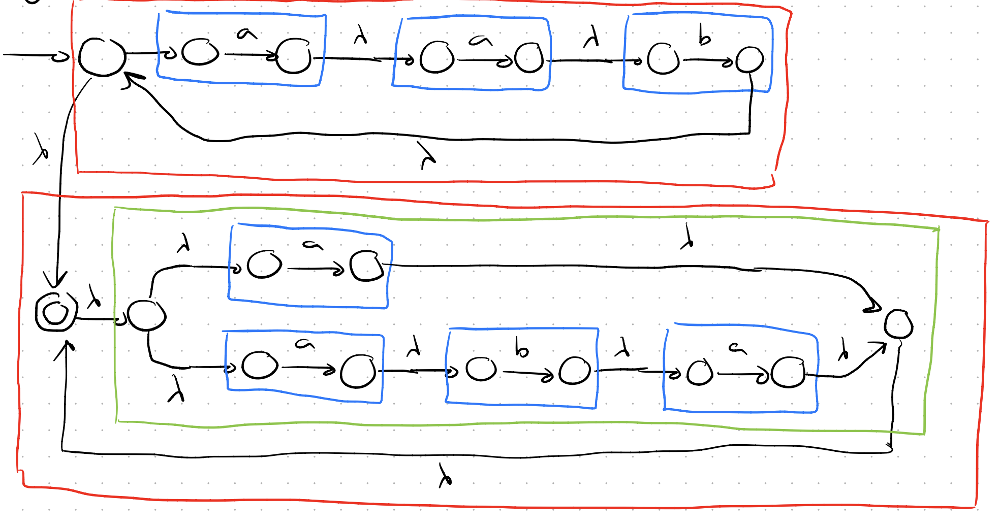
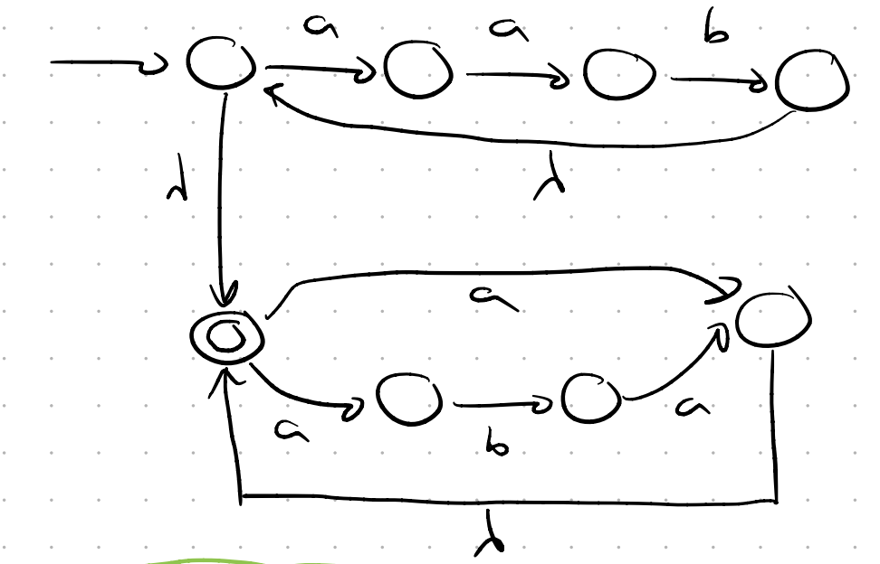
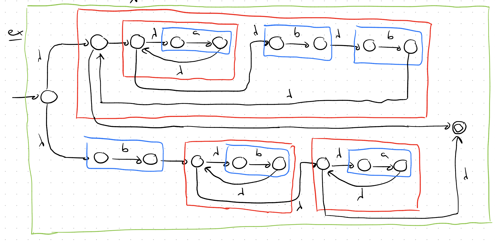
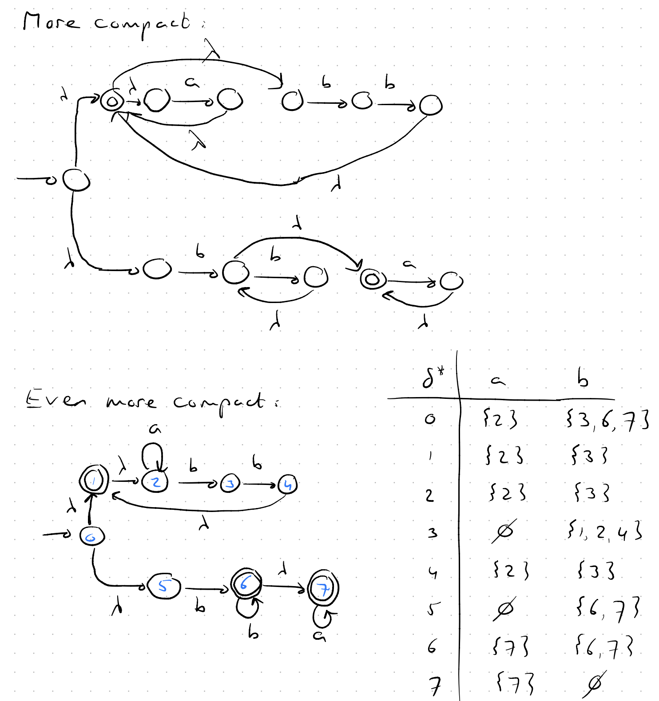
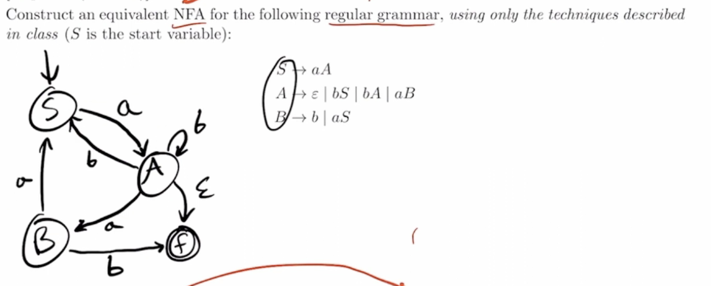

### **Regular Expressions**

* Basic building blocks (primitive regex):

  * `∅` → empty set
  * `λ` → empty string
  * `a` (where `a ∈ Σ`) → single letter

* If `r1` and `r2` are regex, then we can build new ones:

  * `r1 + r2` → choice (either `r1` or `r2`)
  * `r1 r2` → concatenation
  * `r1*` → repeat 0 or more times (Kleene star)
  * `(r1)` → grouping
* **Precedence order:** (), ∗, ·, +
* Sign and Decimal number example:

  ```
  s d d* (. d* + λ)
  ```

  * `s` → + or - (e.g. + or -)
  * `d d*` → digits (e.g. 123)
  * `(. d* + λ)` → optional decimal part (e.g. .45 or empty)

* Valid Date Range:
  * Year: `(19[0-9][0-9] + 20[0-1][0-9] + 202[0-5])` (e.g. 2023)
  * Month: `(0[1-9] + 1[0-2])` (e.g. 01 to 12)
  * Day: `([1-9] + 1[0-9] + 2[0-9] + 3[0-1])` (e.g. 1 to 31)
---

**Thompson's Construction**: Turn **regular expression** $\to$ **NFA**




* Kleene start only have one accept state at the beginning

- Example $r = (aab)^*(a+aba)^*$

 OR


$r = (a^*bb)^* + bb^*a^*$




---

#### Grammer to NFA conversion



- We make a Final state
- Terminals point to Final state