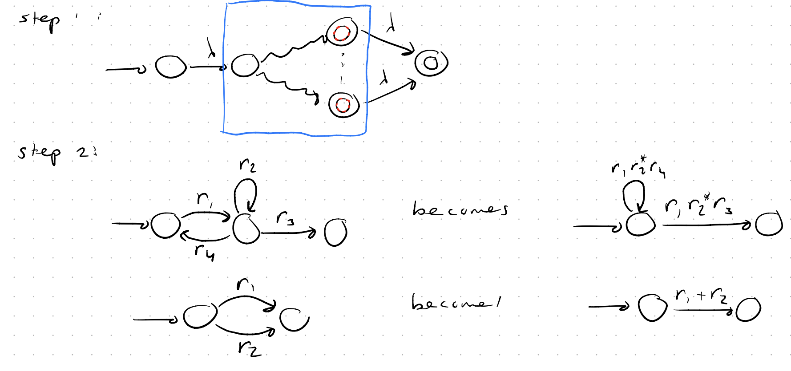
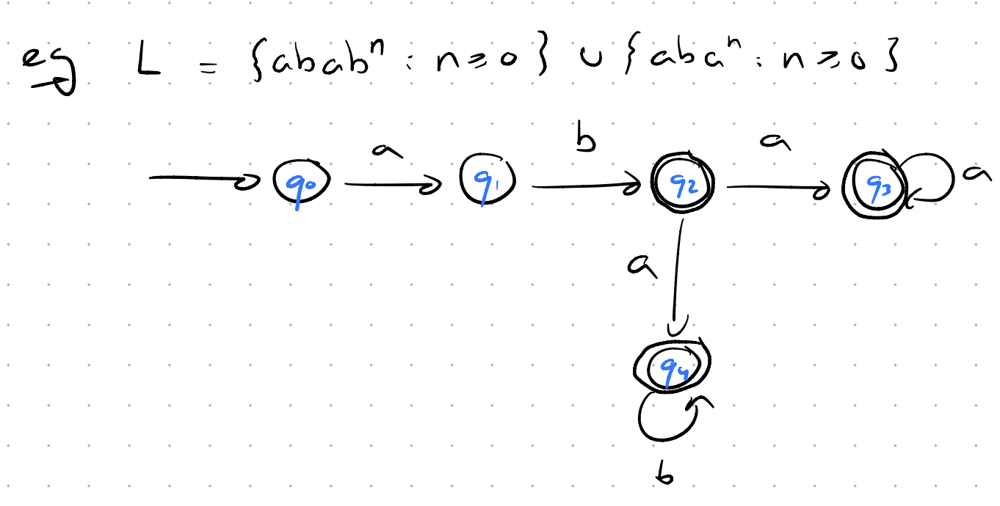
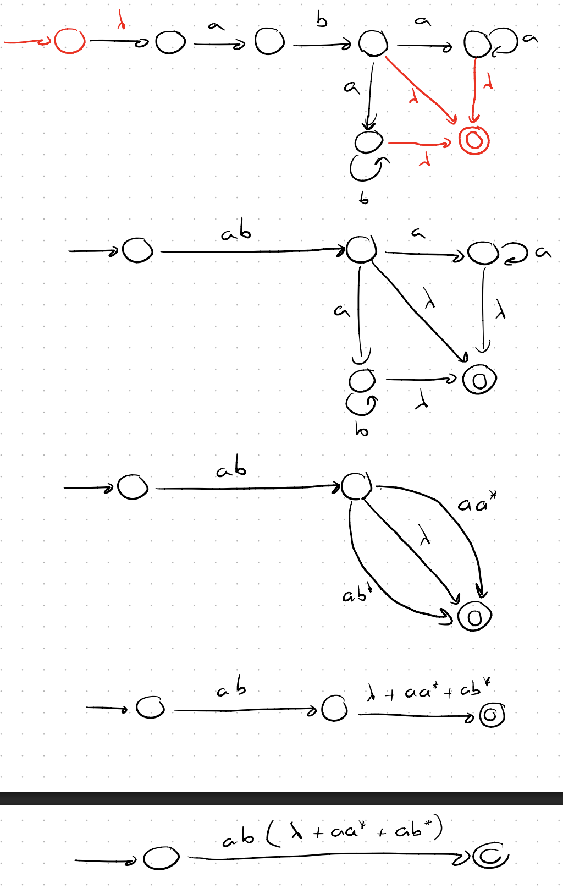
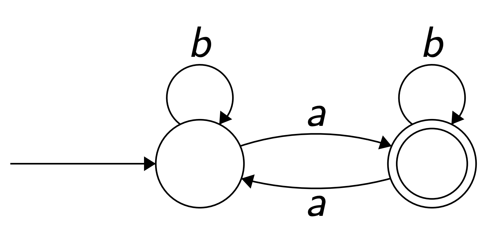
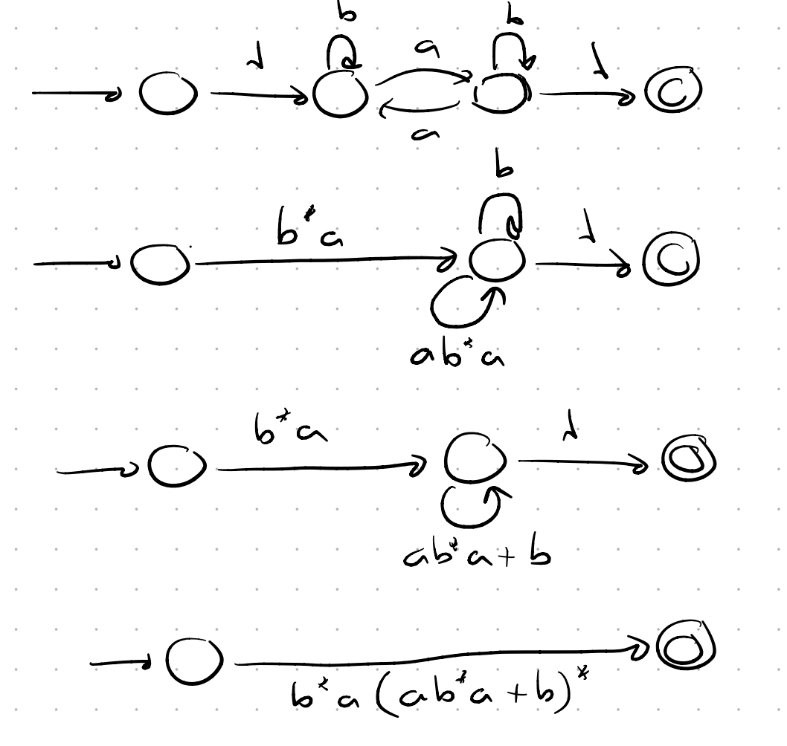

## Brzozowski–McCluskey
### Automaton $\to$ Regular Expression

Step 1 matters: Put $\lambda$-transitions to the beginning of the automaton.

**Also** remove all final states (even if there is only one), add one general one and make $\lambda$-transitions from all previous final states to the new one.

**If** there was two loops on the same state, we can combine them as $(xyz+abc)^*$.

### Example:

Answer:

Example 2:

 

Answer:

