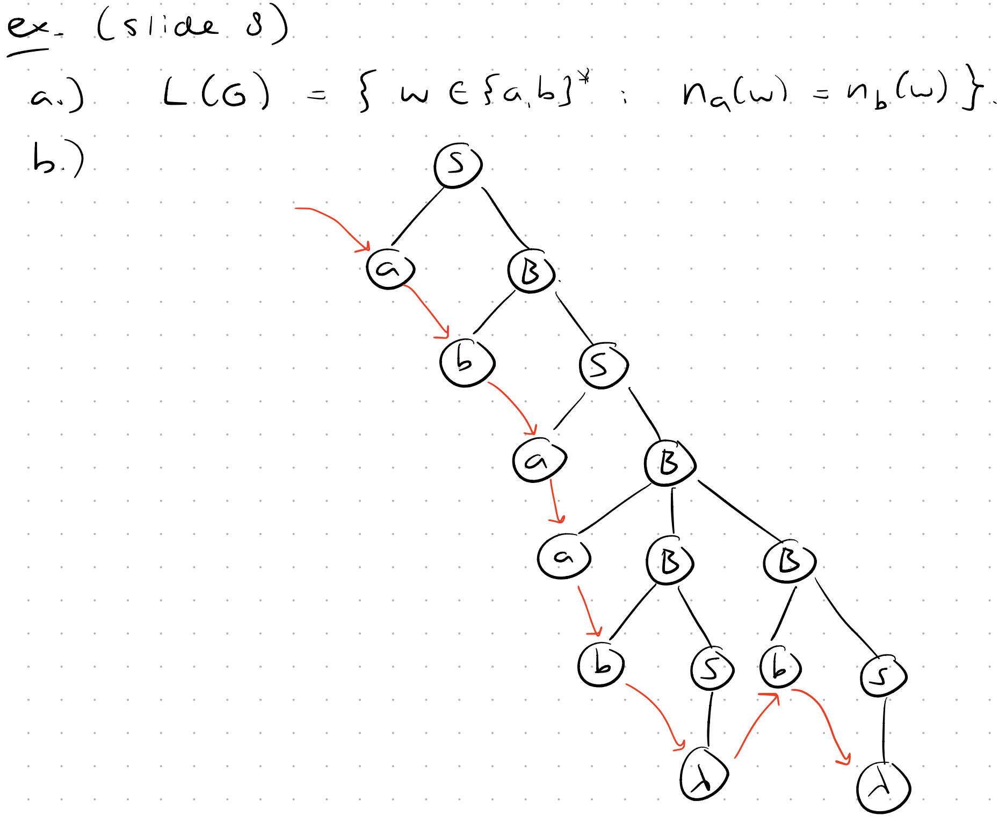

### Context-Free Grammars vs Regular Grammars Distinction

| Grammar | LHS | RHS | Example |
|---------|-----|--------|---------|
| Regular Grammar | Single Non-terminal | Single Terminal or Terminal + only one Non-terminal | A → aB , B → b | $\lambda$ |
| Context-Free Grammar | Single Non-terminal | Any combination of Terminals and Non-terminals | A → aABb , B → a \| $\lambda$ |
---

#### Examples

##### 1- $\{a^n b^n c^n : n >= 0\}$
$S \rightarrow A | \epsilon$

$A \rightarrow aABc | abc$

$cB \rightarrow Bc$

$bB \rightarrow bb$

##### 2- Describle L(G) and draw a parse tree for the string "abaabb"
$S \rightarrow aB | bA | \lambda$

$A \rightarrow aS | bAA$

$B \rightarrow bS | aBB$

---

#### BNF notation
**Backus–Naur Form (BNF)**
* `< >` for **non-terminals** (e.g. `<expression>`)
* Real characters like `+`, `·`, or keywords (`while`) for **terminals**
* `::=` to mean **“is defined as”**
* `|` for **alternatives**

Examples:

`<expression> ::= <term> | <expression> + <term>` $E \rightarrow E + T | T$

`<term>       ::= <factor> | <term> · <factor>` $T \rightarrow T \cdot F | F$

`<while_statement> ::= while <expression> <statement>` $W \rightarrow \text{while } E \; S$

