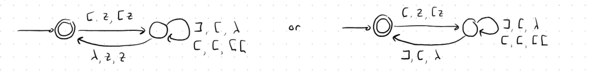
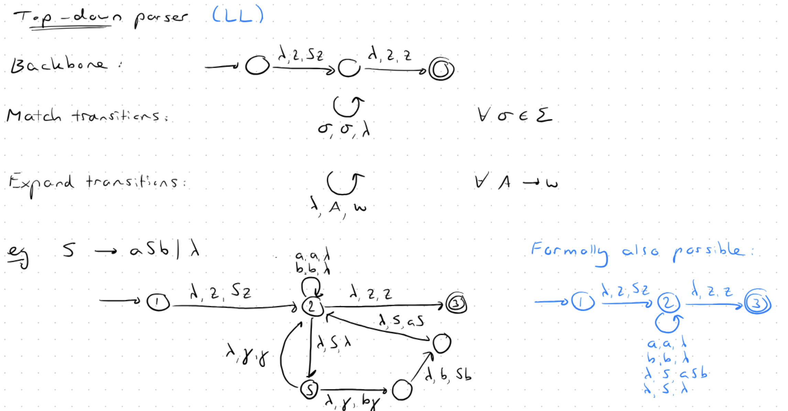
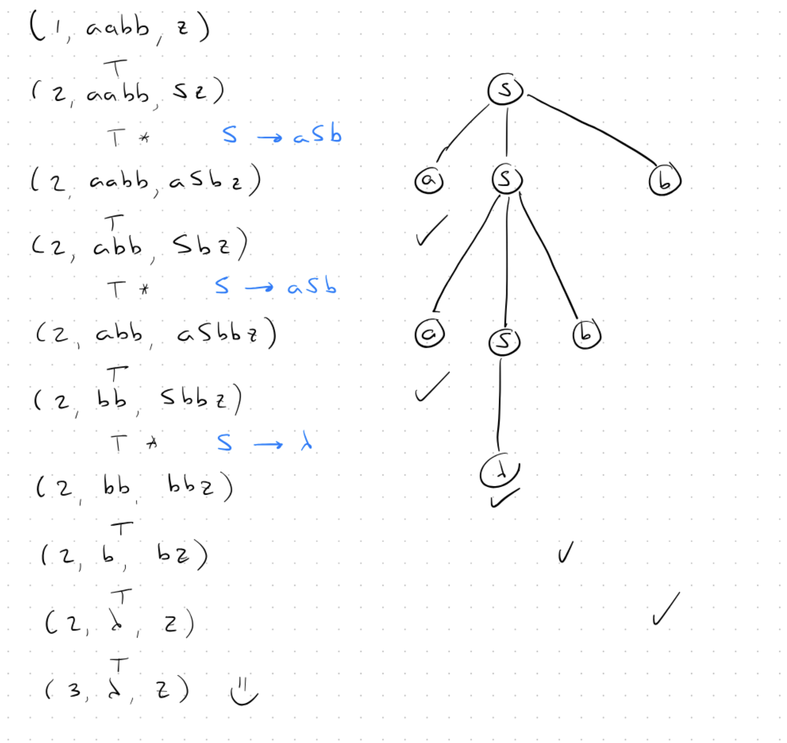
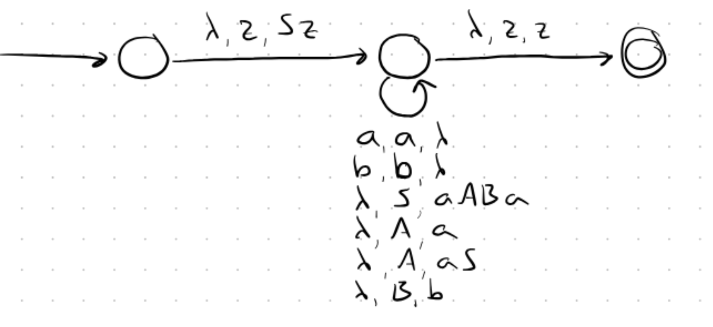
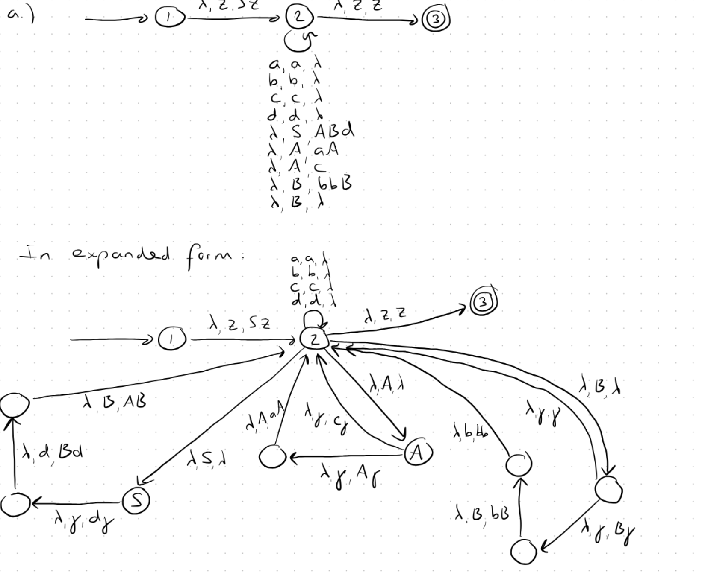

#### Top-Down Parser

$\xrightarrow{a,z,Az}$ means when reading $a$, and the top of the stack was $z$, replace $z$ with $Az$.

$\xrightarrow{a,A,AA}$ means when reading $a$, and the top of the stack was $A$, replace $A$ with $AA$.

$\xrightarrow{b,A,\lambda}$ means when reading $b$, and the top of the stack was $A$, pop $A$ from the stack.

$\xrightarrow{\lambda,z,z}$ means when reading nothing, and the top of the stack was $z$, pop $z$ from the stack.

---

$\Gamma = \{A,z\}$ is the stack alphabet and $z \in \Gamma$ is the initial stack symbol.

Transition function form: $\delta(1,a,z) = \{(2,Az)\} \to$ Means in state $1$ getting $a$, $z$ on top, go to state $2$ and replace $z$ with $Az$.

Notation PDA:

For parsing $w = aabb$:

$(1,aabb,z) ⊢ (2,abb,Az) ⊢ (2,bb,AAz) ⊢ (3,b,Az) ⊢ (3, \lambda,z) ⊢ (3,\lambda,z)$ where in $(1,aabb,z)$, $1$ is the current state, $aabb$ is the remaining input (to read), and $z$ is the current stack content and $⊢$ means move.

---

Examples:

Let **L** be the language on { [ , ] } consisting of the words **w** for which **n₍[₎(w) = n₍]₎(w)**, and moreover, for every prefix **x** of **w**, **n₍[₎(x) ≥ n₍]₎(x)**.

Construct an NPDA **M** for which **L = L(M)**.

---

**Note:** Any Context-Free Language can be converted to Pushdown Automaton.

#### CFA to PDA conversion steps

We first make the backbone of the PDA: Start with $S$ and end with $\lambda$ cleaning stack.

- Matching is when top of stack is a terminal $a$ it will be popped when input symbol is also $a$.
    - Like if top of stack is $a$ and input symbol is also $a$, then we pop $a$ from stack and read $a$ from input.
- Expanding is when top of stack is a variable $S$ it will be replaced by the right side of a production rule.
    - Like if $S \rightarrow aAB | \lambda$ is a production rule, then when top of stack is $S$, we can replace it with $aAB$ or $\lambda$.

##### Now parsing $aabb$:

$S \rightarrow aABs$

$A \rightarrow a | aS$

$B \rightarrow b$

---

#### Expanded form

$S \rightarrow ABd$

$A \rightarrow aA | c$

$B \rightarrow bbB | \lambda$

