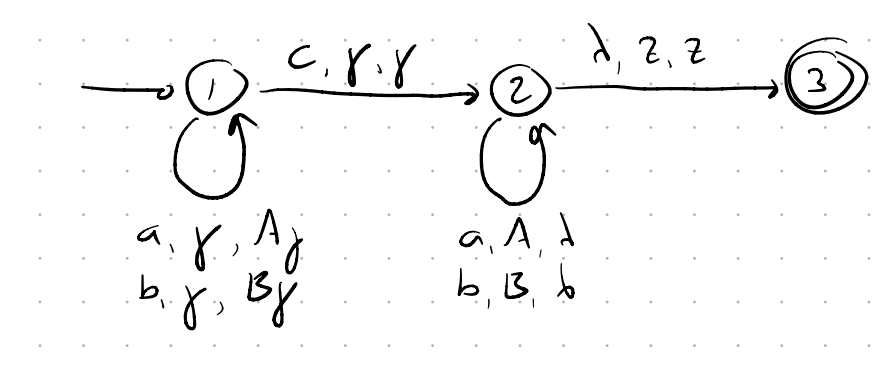

#### Bottom-Up Parser

For **Shift Transition**: Read symbol, whatever we have on stack, we push the symbol on the stack.

For **Reduce Transition**: We look at the stack, and see if we have the right side of any production rule on top of the stack. If we do, we pop those symbols off the stack, and push the left side of that production rule onto the stack.

- If $U \to a|b|\lambda$ from state 1 we make a $(\lambda, \gamma, \gamma$), ($\lambda, a, \lambda$), or $(\lambda, b, \lambda)$ reduce transition to $U$ then return to 1 with $(\lambda, \gamma, U\gamma)$.

- Frist we pass through **Shift** and get two a's on the stack.
- Then with $\lambda, \gamma, \gamma$ we get S on the stack.
- Then we get one B on stack with **Shift** and then loop through **Reduce**
- Then read another S with $\lambda, \gamma, \gamma$, then b from **Shift** and then **Reduce** to get the final S.

For parsing $aabb$

$(1,aabb,z) ⊢ (1,abb,az) ⊢ (1,bb,aaz) ⊢ (S,bb,Saaz) ⊢ (1,b,bSaaz) ⊢ (1.1,b,Saaz) ⊢ (1.2,b,aaz) ⊢ (S,b,az) ⊢ (1,b,Saz) ⊢ (1,\lambda,bSaz) ⊢ (1.1,\lambda,Saz) ⊢ (1.2,\lambda,az) ⊢ (S,\lambda,Sz) ⊢ (2,\lambda,z)$

The blue lines are **Reduction Transitions**

#### Deterministic pushdown accepter

Two requirements on $\delta$:

- $|\delta(q, \sigma, \gamma)| \le 1$ This means the transition function never gives more than one result.

- If $\delta(q, \lambda, \gamma) \neq \emptyset$, then  $\delta(q, \sigma, \gamma) = \emptyset \text{ for all } \sigma \in \Sigma$
  - If you can move without reading input (Lambda transition), then you cannot also have a move that reads a symbol in that same situation.
#### Example of dpda

- Palindrome $L = \{wc{w^r}: w ∈ \{a, b\}^∗ \}$

**Note**: This dpda is deterministic context-free as C is marker to know when to start popping from stack.

But in general Language of palindromes is not deterministic context-free as we have to guess the middle point.

---

#### Full Example on Bottom-Up Parser

Consider the CFG:

$$S → ABd A → aA | c$$

$$B → bbB | λ$$
- a. Construct the bottom-up parser for this grammar.
- b. Use the npda constructed to parse the string $acd$.
- c. Use the npda constructed to parse the string $aacbbd$.

