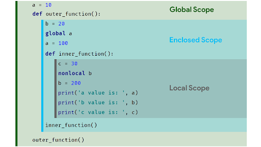

# Advanced Topics in Python


### **Decorators**
- **Definition**: A way to extend the behavior of a function without modifying its source code.
- **Usage**: Useful for logging, access control, timing, and more.

#### **Example: Timer Decorator**
```python
import time

def timer(func):
    def wrapper(*args, **kwargs):
        start = time.perf_counter_ns()
        result = func(*args, **kwargs)
        end = time.perf_counter_ns()
        print(f"{func.__name__} took {end - start} ns")
        return result
    return wrapper

@timer
def factorial(n):
    if n == 0:
        return 1
    return n * factorial(n - 1)

print(factorial(5))
```
### **Scope**
- **Definition**: Defines the region where variables are accessible.
- **Python Scopes**:
  1. **Local Scope**: Inside a function.
  2. **Enclosing Scope**: Surrounding functions (non-local).
  3. **Global Scope**: Defined at the module level.
  4. **Built-In Scope**: Names predefined in Python.


### **Closures**
A closure in Python is a function that "remembers" the values from outter function, even after finishing executing.

#### **Example**:
```python
def outer_function(x):
    def inner_function(y):
        return x + y  # inner_function remembers x from outer_function
    return inner_function  # outer_function returns inner_function

closure = outer_function(5)  # x is 5 here, got remembered by inner_function
print(closure(3))  # inner_function uses x=5 and y=3, so the result is 8
```

The `closure` variable is now holding the inner_function, which remembers the value of x from the outer scope.
When you call `closure(3)`, it will use `x = 5` and `y = 3` to compute the result.
### **Higher-Order Functions**
- **Definition**: Functions that take other functions as arguments or return them.

#### **Example**:
```python
def apply_operation(numbers, operation):
    return [operation(n) for n in numbers]

nums = [1, 2, 3, 4]
print(apply_operation(nums, lambda x: x**2))  # Output: [1, 4, 9, 16]
```