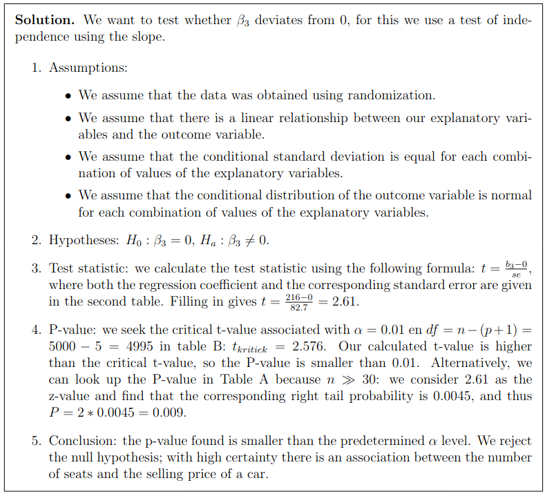

# Variables
- **Explanatory** → Independent  
- **Response Variable** → Dependent  

# Measurement Scale
- **Nominal**: Categorical, no order  
- **Ordinal**: Categorical, with order  
- **Interval**: Meaningful differences, but no true zero  
- **Ratio**: Both meaningful differences and a true zero  
#### **Sampling Methods**
- **Simple Random Sampling**: Equal chance for all.
- **Systematic Sampling**: Select every $k^{th}$ individual.
- **Stratified Sampling**: Divide into strata(Groups), then pick random samples.
    - **Proportional**: Sample proportions match population proportions.
    - **Disproportional**: Strata are sampled differently from their population proportions.
- **Cluster Sampling**: Randomly select entire clusters.
- **Multistage Sampling**: Combine methods across stages.

#### **Sampling Terms**
- **Sampling Error**: Random fluctuation; unavoidable but predictable.
- **Bias**: Systematic error; due to flawed design, not random.
    - **Sampling Bias**: Non-representative sample.
    - **Response Bias**: Misleading questions or incorrect answers.
    - **Nonresponse Bias**: Missing data or refusal to participate.
### Publication Bias
- Studies with **non-significant p-values** are **less likely** to be submitted  

# Tests
- **Chi-Square Test**: Tests categorical variable independence  
- **Linear Regression**: Type matters (relationship, correlation)  
  - Regression slope (β): equation slope ≠ 0  
    - **H₀**: β = 0 No relationship
    - **Hₐ**: β ≠ 0 Relationship exists
    - **Exam notation**: $H₀: β = 0$, $Hₐ: β < 0$
  - Correlation (ρ): Measures strength and direction  
    - **ρ = 1**: Perfect positive correlation
    - **ρ = -1**: Perfect negative correlation
    - **ρ = 0**: No correlation
    - **Exam notation**: $H₀: ρ = 0$, $Hₐ: ρ < 0$
- **t-test (One-sample)**: Compare sample mean to a value 
    - **H₀**: $\mu_x = \mu_y$
    - **Hₐ**: $\mu_x ≠ \mu_y$
- **Z-test**: Compare proportions of two categories $H₀: \pi_1 = \pi_2$, $Hₐ: \pi_1 ≠ \pi_2$

# Hypothesis
- **Null Hypothesis (H₀)**: Assume no effect or difference  
- **Alternative Hypothesis (Hₐ)**: H₀ ≠ Hₐ  

## Regression Hypothesis
- **H₀**: The coefficient (β) of the variable being tested is zero  
- **Hₐ**: β ≠ 0  

- **t-test formula for regression coefficient**:
  - $t = \frac{b \text{ (estimated coefficient)}}{SE \text{ (Standard Error)}}$

- **Determine Critical Value**:
  - Find degrees of freedom  
    - $df = n - (p + 1)$
    - where:
      - *n* = number of observations  
      - *p* = number of explanatory variables: all variables in $\hat{y} - Find critical *t*-value - **Compare |t| with t-critical**: - If$|t| > t_c$: - Reject H₀ - If$|t| \leq t_c$:
    - H₀ is valid  

- **P-value**:
  - If **p < α**:
    - Reject H₀  
  - If **p > α**:
    - H₀ is valid  

### Right exam notation

## Running Another Model on Regression
- **F-test** (If common variables): Compare **full model** with a reduced model(less variable)
- **(If no common variables)**: AIC, BIC, MDL

## Multiple Correlation Coefficient (R)

The strength of the association between the observed values and the predicted values in a **multivariate linear regression model** is measured by the **multiple correlation coefficient (R)**.

- **Definition**: Multiple correlation $R$ represents how well the independent variables together predict the dependent variable.
- **Range**: $0 \leq R \leq 1$
  - $R = 0$ → No correlation (the predictors do not explain the variation in the dependent variable).
  - $R = 1$ → Perfect correlation (the predictors explain all the variation in the dependent variable).
- **Interpretation**: Higher values of $R$ indicate a stronger relationship between the predicted and observed values.

## P-value Interpretation
Liklihood of observing the data if the null hypothesis is true
- **Low (p ≤ 0.05)** → Reject H₀  
- **High (p > 0.05)** → H₀ valid  

### **Standardized Regression Coefficients $( b^*_i )$**
$b^*_i = b_i \times \left( \frac{s_{X_i}}{s_Y} \right)$

Where:  
- $b_i$ = **Unstandardized regression coefficient** (from regular regression).  
- $s_{X_i}$ = **Standard deviation of independent variable $X_i$**.  
- $s_Y$ = **Standard deviation of dependent variable $Y$**.
### **Error Types in Hypothesis Testing**  

- Example: If α= significance level = 0.01, then there's a **0.01 probability** of a false positive  

1. **Type I Error (False Positive (p-value $< 0.05$))**  
   - This occurs when we **reject a true null hypothesis** ($H_0$).  
   - It means we **conclude there is an effect** when in reality there isn’t one.  

2. **Type II Error (False Negative (p-value $\geq 0.05$))**  
   - This occurs when we **fail to reject a false null hypothesis** ($H_0$) and **miss detecting a real effect**.  
   - The probability of Type II error is **$\beta$**, and **$1 - \beta$** is called **statistical power** (ability to detect an effect when it exists).

# Showing Randomness
**Z-score Formula:**
$Z = \frac{\hat{\pi} - \pi}{\sigma_{\hat{\pi}}}$

where:  
- $\hat{\pi}$ = observed occurrences  
- $\pi$ = sample size  
- $\sigma_{\hat{\pi}} = \sqrt{\frac{\pi(1 - \pi)}{n}}$  

### **Z-Values for Common Confidence Levels**
| **Confidence Level** | **Critical $z$-Value** |
|----------------------|---------------------|
| **90%** | **$z = 1.645$** |
| **95%** | **$z = 1.96$** |
| **99%** | **$z = 2.575$** |

### **(Minimum) Sample Size for Proportion Estimates**

$$n = \pi (1 - \pi) \times \left(\frac{z}{M}\right)^2$$

Where:
- **$ n $** = required sample size  
- **$ \pi $** = estimated proportion (use 0.5 if unknown for the **largest variability**)  
- **$ z $** = Z-score for the desired confidence level (e.g., **1.96 for 95%**, **2.575 for 99%**)  
- **$ M $** = desired margin of error (how much deviation from the true value is acceptable)

# Publication Bias
- Studies with **non-significant p-values** are **less likely** to be submitted  

## Residuals
- **Formula**: $Residual = \text{Actual amount} - \text{Predicted amount}$
   $MSE = \text{Mean Squared Error} = \frac{SSE \text{(Sum of Squared Errors)}}{n}$

**Standard Deviation of Residuals**:

   $\sigma_{\text{residuals}} = \sqrt{MSE}$

# Standard Residual Formula
$\text{Standard Residual} = \frac{O - E}{SE}$

where:  
- **O** = observed value  
- **E** = (row total × column total) / grand total  
- **Standard Error (SE)** = $\sqrt{E \times ( 1 - \frac{\text{row total}}{\text{grand total}}) \times (1 - \frac{\text{column total}}{\text{grand total}})}$
  - **Higher residuals** indicate **significant deviation**  

# Odds Ratio (OR)
- Measures **association between two categorical variables**  
$\text{Odds} = \frac{P (\text{event happens})}{P (\text{event does not happen})}$
- $\text{OR} = \frac{Pdds Group 1}{Odds Group 2}$ 
  - **OR = 1**: No association
  - **OR > 1**: Group 1 is OR times more likely to have the event  

# Simpson’s Paradox
- **Association between two variables (X & Y) reverses direction when a third variable (Z) is considered**  
- **Best visualized using a scatter plot**

### Observational vs Experimental studies

In observational studies, data is collected only, without the researcher
changing anything about the situation. In experimental studies, the researcher does
an intervention, exposing different groups to different conditions. By randomizing
the groups, the effects of different conditions can be compared. Causal relationships
can therefore only be demonstrated with experimental studies, not observational
studies.

- **Sampling frame**: Complete list or database of all individuals in a population.
#### **$R^2$ (Coefficient of Determination)**
$R^2 = 1 - \frac{SSE}{TSS}$
- **Measures how well the regression model explains the variation in the response variable.**
- **$TSS$ (Total Sum of Squares)**: Total variability in the data.
- **$SSE$ (Sum of Squared Errors)**: Unexplained variability (error).
- **Interpretation**:
  - $R^2 = 1$: Perfect fit (all variance explained).
  - $R^2 = 0$: No predictive power (model explains nothing).
  - Higher $R^2$ means a better model.

#### **$F$-Test for Comparing Regression Models**
$F = \frac{(SSE_{\text{reduced}} - SSE_{\text{complete}}) / df_1}{SSE_{\text{complete}} / df_2}$
- Used to **compare two nested regression models** (one with extra predictors).
- **$SSE_{\text{reduced}}$**: Error in the simpler model.
- **$SSE_{\text{complete}}$**: Error in the more complex model.
- **$df_1$**: Difference in the number of predictors.
- **$df_2$**: Remaining degrees of freedom. $df_2 = n - (p - 1)$.
- **Interpretation**:
  - If $F$ is **large** → Adding predictors significantly improves the model.
  - If $F$ is **small** → New predictors do not add much value.

#### **Overfitting**

Overfitting occurs when the model captures not only the underlying patterns but also the noise in the training data, leading to perfect predictions on the training set but poor performance on new data. To address this, simplify the model by reducing the number of explanatory variables (checking for multicollinearity) or by collecting more data.

Variance:
$S^2 = \frac{\sum (y_i - \bar{y})^2}{n - 1}$

Standard Deviation:
$S = \sqrt{\frac{\sum (y_i - \bar{y})^2}{n - 1}}$