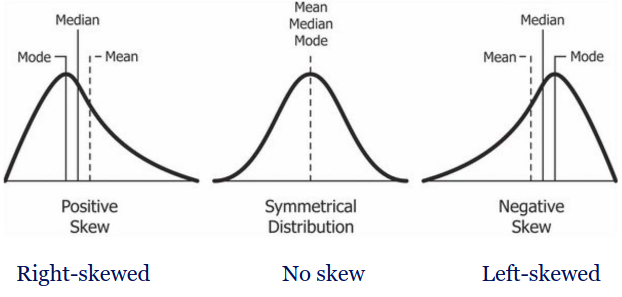

 #### **1. Tables and Graphs**  
- **Frequency Distribution**: Shows counts or proportions for values/intervals.  
- **Graphs**:
  - **Bar Plot**: For categorical data.  
  - **Histogram**: For continuous data, shows distribution shape (e.g., symmetric, skewed, bimodal).  

#### Boxplot

#### **2. Numerical Descriptions**  
- **Measures of Center**:
  - **Mean**: Average, sensitive to outliers.  
  - **Median**: Middle value, robust to outliers.  
  - **Mode**: Most frequent value (useful for categorical/binned data).  
  

- **Measures of Variability**:
  - **Range**: Difference between max and min.  
  - **Standard Deviation (SD)**: Average distance from the mean.  
  - **Variance**: Square of SD.  

Variance:
$S^2 = \frac{\sum (y_i - \bar{y})^2}{n - 1}$

Standard Deviation:
$S = \sqrt{\frac{\sum (y_i - \bar{y})^2}{n - 1}}$

### **Describing Categorical Variables: Proportion**
Ratio of a specific category to the total number of observations in a dataset.

- **Formula**:

$$\hat{\pi} = \frac{o}{n}$$

- $o$: Number of occurrences of the specific category.  
  - $n$: Total sample size.

#### **3. Measures of Position**  
- **Percentiles**: Indicate data position relative to the whole.  
  - Quartiles: 25% (Q1), 50% (Median), 75% (Q3).  
  - **Interquartile Range (IQR)**: $ Q3 - Q1 $.  
- **z-Score**: Distance from mean in SD units.

| Sample (statistic)  | Population (parameter) |
|----------------------|------------------------|
| Mean $ \bar{y} $    | $ \mu $               |
| Proportion $ \hat{p} $ | $ \pi $            |
| Variance $ s^2 $    | $ \sigma^2 $          |
| Standard deviation $ s $ | $ \sigma $      |
