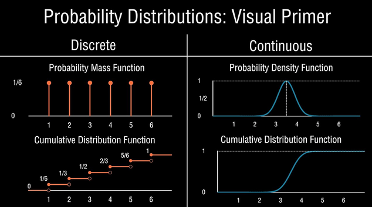

- **Bivariate descriptions**: Analysis of two variables simultaneously to determine if there is a relationship or association between them (e.g., box plot, scatterplot).

#### **Normal Distribution**
- **Characteristics**:
  - Symmetric, bell-shaped.
  - Defined by `𝑁(𝜇, 𝜎)`: mean (µ) and standard deviation (σ).
- **Probabilities**:
  - ±1σ: 68%.
  - ±2σ: 95%.
  - ±3σ: 99.7%.
- **Z-Score**:
  - Measures how many standard deviations a value is from the mean.
  - Formula: $z = \frac{y - \mu}{\sigma}$.

---

#### **Sampling Distributions**
- **Definition**:
  - Distribution of a statistic (e.g., sample mean) from repeated sampling.
- **Key Points**:
  - Mean of sampling distribution = Population mean.
  - Standard Error (SE): $\sigma_{\bar{y}} = \frac{\sigma}{\sqrt{n}}$.
  - SE decreases as sample size (n) increases.
- **Central Limit Theorem (CLT)**:
  - For large $n$, sampling distribution approximates normal, regardless of population distribution.