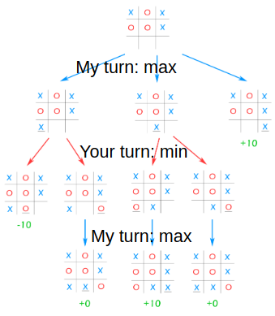

- **State:** $\in$ **State Space:**
- **Actions:** Possible moves
- **Transition:** Change in state.
- **Frontier:** The list of states that still can be expanded.
---

## **Uninformed Search**:
Uninformed search algorithms don’t have prior knowledge of the problem domain. They explore blindly without any information on the cost or distance to the goal.

#### 1. Depth-first search:
Memory efficient, time inefficient

#### 2. Breadth-first search:
Optimal if each action has same cost

Memory inefficient, time efficient


#### 3. Iterative deepening:
Complete, Optimal (if each action has same cost) and lower memory requirements

Combines depth and breadth:
```bash
For maxdepth (0 to …)
Push A to frontier.
{ node=Pop frontier
If node.depth < maxdepth
Push node.children to frontier
} Repeat until frontier.empty or goal.
```
```bash
        A
       / \
      B   C
     / \   \
    D   E   G

```
#### **Steps of IDS**
1. **Start with Depth 0**:
   - Perform a depth-first search (DFS) up to depth 0.
   - If the goal is not found, increase the depth limit.

2. **Increment Depth**:
   - Repeat DFS for increasing depth limits (1, 2, 3, …) until the goal is found.

3. **Terminate**:
   - Stop once the goal is found or the entire search space is explored.


- Start with Depth 0: The algorithm first searches the tree/graph up to depth 0 (only the start node).
- Increase the Depth Limit: After finishing the search at depth 0, it increases the depth limit by 1 and explores all nodes up to depth 1.
- Repeat: This process is repeated, incrementing the depth limit each time, until the goal is found or all nodes are explored.

#### 4. Uniform Cost Search:

Memory efficient, time efficient
```bash
   A
  / \
 2   3
/     \
B       C
|\     /|
4 1   2 5
|  \ /  |
D   E   F
 \  |   |
  \ |   |
   \|   |
    G   G
```
#### Steps:
1. **Initialization**:
   - Start with `A` in the queue: `(A, cost=0)`.

2. **Expansion**:
   - Expand `A`, generating successors `B` (cost 2) and `C` (cost 3).
   - Queue: `[(B, cost=2), (C, cost=3)]`.

3. **Next Node**:
   - Expand `B` (lowest cost in the queue). Add successors `D` (cost 6) and `E` (cost 3).
   - Queue: `[(C, cost=3), (E, cost=3), (D, cost=6)]`.

4. **Tie-Breaker**:
   - Expand `C` (next lowest cost). Add successors `E` (cost 5) and `F` (cost 8).
   - Queue: `[(E, cost=3), (D, cost=6), (E, cost=5), (F, cost=8)]`.

5. **Next Node**:
   - Expand `E` (lowest cost). Add successor `G` (cost 4).
   - Queue: `[(D, cost=6), (E, cost=5), (F, cost=8), (G, cost=4)]`.

6. **Goal Reached**:
   - Expand `G`. The cost is 4, and since it is the goal, terminate.

#### Solution:
The shortest path from **A** to **G** is `A → B → E → G` with a total cost of **4**.
```bash
Push A to frontier; //add start node to frontier stack.
{ node = pop argmin(c(n)); // remove lowest cost node from frontier
UpdateMinCostAndPush node.children to frontier; // add to top of stack
} Repeat until frontier.empty or node=goal; //fail or goal reached
```
<hr>

## Informed (Heuristic h(n)) Search

- **$f(n) = g(n) + h(n):$**
    - g(n): The actual cost to reach the current node n from the start.
    - h(n): The estimated cost (heuristic) from node n to the goal. The heuristic should be admissible (never overestimates the actual cost) or consistent (cost estimates decrease steadily).

##### Example of h(n):
If you’re navigating a map, g(n) would be the distance traveled so far, and h(n) could be the straight-line distance (Euclidean distance) to your destination. A* would guide you towards paths that seem both short and efficient based on those values.

#### A* Search:

Combines the actual cost to reach the node (g(n)) and the estimated cost from that node to the goal (h(n)). A* is both complete and optimal if the heuristic is admissible (never overestimates the cost) and consistent (monotonically non-increasing).

- **A\* Search** minimizes the total solution cost by using the function $ f(n) = g(n) + h(n) $.
  - **Admissible:** Because Euclidean distance is the shortest possible path, it will never overestimate.
  - **Consistent:** As you move closer to the goal, the estimated cost $ h(n) $ won’t increase unexpectedly.

- **Algorithm Steps:**
  1. Add the start node (A) to the frontier.
  2. Repeatedly pick the node from the frontier with the lowest f(n) (best estimated total cost).
  3. Add its child nodes to the frontier.
  4. Continue until you reach the goal or the frontier is empty (failure).


A* combines two main ideas: actual cost to reach a node and an estimated cost to the goal.


<hr>

## Adversarial Search

This is used in games where two players compete. The goal is to minimize the opponent's gains while maximizing your own.

#### Minimax Algorithm:

Simulates all possible moves for both players and chooses the action that maximizes your minimum gain (assuming the opponent plays optimally).

Basically uninformed adversarial tree-search with leave nodes with a value (win/loss/draw) and other nodes have no or 0 value.



```python
def Minimax(node, turn):
    if node.is_leaf():
        return value(node)
    
    if turn:  # Maximizing player
        for child in node.children:
            u = max(u, Minimax(child, False))
    else:  # Minimizing player
        for child in node.children:
            u = min(u, Minimax(child, True))
    
    return u
```

---


### **Pruning in Search**
Pruning is a technique used in search algorithms to eliminate unnecessary branches from the search tree, thereby reducing the computational effort without affecting the correctness of the solution.


### **Alpha-Beta Pruning with Minimax**:

An optimization of Minimax that reduces the number of nodes evaluated by “pruning” branches that won’t affect the final decision.

##### Key Idea
- While evaluating a node:
  - If you find a move for the **Maximizer** that is worse than a move already considered for the **Minimizer** (or vice versa), stop exploring further moves in that branch.
  - **Prune** branches that cannot influence the outcome.


##### How Alpha-Beta Pruning Works
1. **Start with Initial Alpha and Beta**:
   - Alpha = `-∞` (worst-case for Maximizer).
   - Beta = `+∞` (worst-case for Minimizer).

2. **Propagate Values**:
   - At each Max node: Update Alpha to the maximum of its children.
   - At each Min node: Update Beta to the minimum of its children.

3. **Prune**:
   - If Alpha ≥ Beta at any point, stop exploring further branches below that node.
```python
def alphabeta(node, isMaximizingPlayer, alpha, beta):
    # If the node is a leaf node (i.e., end of the game)
    if node.is_leaf():
        return node.value()  # Return the value of the leaf node
    
    # If the current player is the maximizing player (the agent)
    if isMaximizingPlayer:
        maxEval = -infinity  # Initialize the maximum evaluation
        for child in node.children:
            # Recursively apply alphabeta on the child node
            eval = alphabeta(child, False, alpha, beta)
            maxEval = max(maxEval, eval)  # Update the best move for the maximizing player
            alpha = max(alpha, eval)  # Update alpha
            if beta <= alpha:  # Prune the search if beta is less than or equal to alpha
                break
        return maxEval
    
    # If the current player is the minimizing player (the opponent)
    else:
        minEval = infinity  # Initialize the minimum evaluation
        for child in node.children:
            # Recursively apply alphabeta on the child node
            eval = alphabeta(child, True, alpha, beta)
            minEval = min(minEval, eval)  # Update the best move for the minimizing player
            beta = min(beta, eval)  # Update beta
            if beta <= alpha:  # Prune the search if beta is less than or equal to alpha
                break
        return minEval
```
| Criterion        | Breadth-First      | Uniform-Cost          | Depth-First | Depth-Limited | Iterative Deepening | Bidirectional (if applicable) |
|------------------|--------------------|------------------------|-------------|---------------|---------------------|-------------------------------|
| **Complete?**    | Yes $^a$           | Yes $^{a,b}$           | No          | No            | Yes $^a$            | Yes $^{a,d}$                  |
| **Time**         | $O(b^d)$          | $O(b^{1+C^*/\epsilon})$ | $O(b^m)$    | $O(b^\ell)$   | $O(b^d)$           | $O(b^{d/2})$                 |
| **Space**        | $O(b^d)$          | $O(b^{1+C^*/\epsilon})$ | $O(bm)$     | $O(b^\ell)$   | $O(bd)$            | $O(b^{d/2})$                 |
| **Optimal?**     | Yes $^c$           | Yes                   | No          | No            | Yes $^c$            | Yes $^{c,d}$                  |
