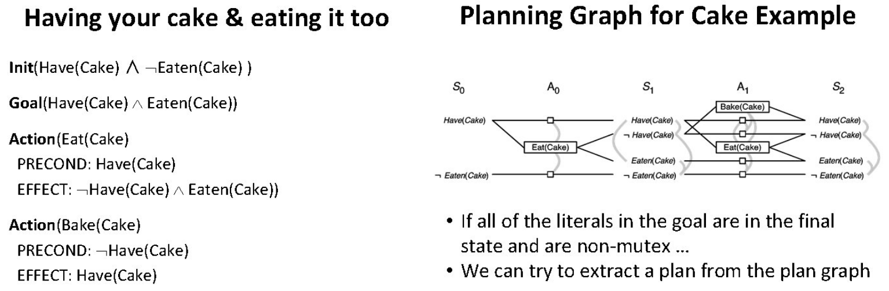

### Planning key difference with inference
- Actions have effects on the knowledge base

- They change things over time
#### **Planning domain description language (PDDL)**

• A way to write down actions and their effects
- **Structure**:
  - **Action**: `Action(predicate(...))`.
  - **Preconditions**: Conditions that must hold true before the action can be executed (e.g., `predicate(...)`).
  - **Postconditions**:
    - **Add effects**: Conditions that become true after the action (`Add(a)`).
    - **Delete effects**: Conditions that are no longer true after the action (`Del(a)`).
  - **Action effects**:
    - Formula: `Result(s, a) = (s - Del(a)) ∪ Add(a)`.
    - `s`: Current state, `a`: Action.


#### **Example: Blocksworld**

### Initial State (Left):
```
    [A]
    [B]   [C]
  ---------
```
### Goal State (Right):
```
    [C]
    [A]
    [B]
  ---------
```

**Initial State:**  
`on(a, b), on(b, table), on(c, table), clear(a), clear(c)`

**Goal State:**  
`on(c, a), on(a, b), on(b, table)`

**Actions:**  
- **move(block, from, to):**  
  - *Pre:* `on(block, from), clear(block), clear(to), block != to, block != from, from != to`  
  - *Post:* `on(block, to), -on(block, from), clear(from), -clear(to)`  

- **moveToTable(block, from):**  
  - *Pre:* `clear(block), on(block, from), block != from`  
  - *Post:* `on(block, table), clear(from), -on(block, from)`

### **Planning Workflow**
1. **Initial State**:
   - Define the current conditions of the environment.
2. **Goal State**:
   - Specify the desired conditions after planning.
3. **Actions**:
   - Write actions with preconditions and effects using PDDL.
4. **Plan Generation**:
   - Use AI algorithms (e.g., **state-space search**, **heuristic search**) to find a sequence of actions that transitions the system from the initial state to the goal state.
---

### Planning Algorithms

#### **Forward Progression**
- Keep firing action rules until the goal state is achieved.
- Process:
  - Match preconditions, apply postconditions:  
    `s' = (s - Del(a)) U Add(a)`
- Can use algorithms like Depth-First Search, Breadth-First Search, or A*.

#### **Backward Regression**
- Start from the goal state and apply "inverse" postconditions.
- Process:
  - Instantiate action rules with the goal state:  
    `s' = (s - Add(a)) U preconditions(a)`


#### **Forward Search**
- Issue: **Redundant states**
  A method where you start from the initial state and keep applying actions (**preconditions, postconditions**)  until you reach the goal state. It can be **inefficient** because it tries **every possible action** without focusing on what’s important.

#### **Backward Search**
- Issue: **Non-determinism**
  - Can't account for `Del(a)`, so the previous state isn't fully known.
  - Need to track **state sets** during regression.
  - If `Del(a)` is a postcondition:
    - `a` could be true or false in the previous round.
    - Introduces **non-determinism**.

#### **Most Planners**
- Prefer **forward search**.
- Aim to reduce the **branching factor** of the reachability graph.

---

### **Graphplan: Forward Search with Heuristics**

A smarter version of forward search that uses a **planning graph** to make the search more efficient.

- **Planning Graph Features:**  
  1. **Tracks Reachability:**  
     - It shows which actions are possible from the current state.
     - It also shows which literals (conditions) can be true at each step.

  2. **Uses Mutex Relations:**  
     - A "mutex" (mutual exclusion) identifies **conflicts** between actions or conditions, so it avoids wasting time on impossible plans.  
 

  3. **Persistency Actions (No-op):**  
     - Adds "do nothing" actions to keep conditions (literals) true when no action changes them.  

- **How it Helps:**  
  - The planning graph gives a **polynomial-time way** to check what is possible.  
  - It **prunes irrelevant actions** and reduces the number of possibilities the algorithm has to explore.  

- **Still Exponential:**  
  While the actual search for a solution still requires exponential time, **Graphplan** reduces the branching factor (the number of options at each step), making the search faster.

### **Planning and Goal-Oriented Agents**

#### **Other Ways of Making Plans**
1. **Using Knowledge Representation:**
   - **Reduction to propositional logic:** Represent planning as a logical problem to solve using propositional formulas.
   - **Reduction to predicate logic (situation calculus):** Use first-order logic to describe situations and changes.
   - **Constraint satisfaction:** Treat planning as a problem of finding values for variables that meet constraints.

2. **Without Knowledge Representation:**
   - Assume the agent’s **knowledge base (KB)** is an atomic state.
   - Use **standard tree search algorithms**, checking at each node if the goal predicates are provable.

---

### **Goal-Oriented Agents**
1. **Characteristics:**
   - Select sequences of actions to achieve a goal state.
   - Operate in real-world environments:
     - **Partial knowledge:** Do not have a full description of the world.
     - **Sensors:** Perceive parts of the world.
     - **Actions:** Can interact with the environment but may fail.

2. **Requirements:**
   - Need a detailed representation of their mental state (facts, goals, and intentions).
   - Require more complex rule execution and reasoning.

---

### **BDI Architecture** (Belief-Desire-Intention)
1. **Belief Base:**  
   - Facts known to the agent.  
   - Example: The agent knows it is at location X.

2. **Desires Base:**  
   - Goals the agent wants to achieve.  
   - Example: The agent desires to reach location Y.

3. **Intention Base:**  
   - Actions the agent can execute based on its goals and preconditions.  
   - Example: Move from X to Y.

---

### **Agent Program Structure**
1. **Percept Rules:**
   - Triggered when the agent senses the world.
   - Add new facts to the belief base.
   - Example: `at(X) & passage(Y) → +link(X, Y)`

2. **Program Rules:**
   - Define reasoning processes and determine:
     - Which actions are appropriate (intentions).
     - Which goals to pursue (desires).
     - What is true or false (beliefs).

3. **Action Rules:**
   - Define the effects of actions (postconditions).

---

### **4-Step Reasoning Cycle**
1. **Sense:**  
   - Sensors detect stimuli, triggering percept rules to update the belief base.  

2. **Think:**  
   - Evaluate program rules to decide:  
     - Goals (desires), facts (beliefs), and appropriate actions (intentions).

3. **Decide:**  
   - Prioritize actions (e.g., through planning) and select one to execute.

4. **Act:**  
   - Execute the action. If successful, update the belief base with its postconditions.

---

### **Goal-Oriented Agents: Full Cycle**
- **Program Rules:** Logic for deciding actions.
- **Environment:** World in which the agent operates.
- **Percepts:** Data collected by sensors.
- **Actuators:** Mechanisms to perform actions in the environment.
- **Beliefs, Desires, Intentions:** Mental state used for reasoning.

---

### **Knowledge and Rules**
- Represented as **logical statements** (usually predicate logic).
- Supports:
  - **Knowledge representation:** Facts stored as predicates.
  - **Inference:** Deduction of new knowledge (similar to Prolog).

- **Reserved Predicates:**
  - Add/remove facts to/from the belief base (`assert`, `retract` in Prolog).
  - Add/remove goals to/from the desire base.
  - Add actions to the intention base.

---

### **Goal-Orientation vs. Planning**
1. **Relationship:**
   - Planning agents must be goal-oriented because plans are made to achieve goals.
   - Not all goal-oriented agents explicitly plan.

2. **Examples of Goal-Orientation without Planning:**
   - **Dynamic programming:** Optimize actions based on a state-value function.
   - **Evolutionary search:** Use genetic algorithms to achieve goals.
   - **Reactive agents:** Respond directly to stimuli without constructing plans.
   - **Reinforcement learning agents:** Learn actions to maximize rewards.