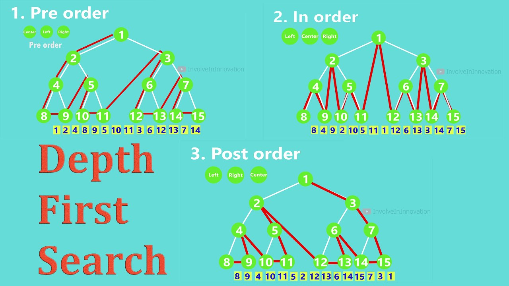
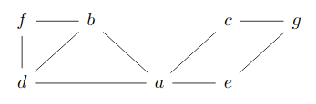
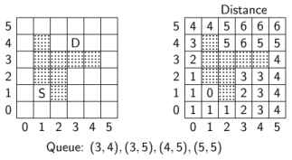

# Graph Traversal, State-spaces
# Depth-first-search Summary and Steps

### Steps:
1. Start with a given vertex v.
2. Move to an adjacent unvisited vertex.
3. Continue this process until no further movement is possible.
4. Backtrack to the last visited vertex.
5. Explore the next unvisited adjacent vertex.
6. Repeat steps 2-5 until all vertices reachable from v are visited.
7. Keep track of visited vertices to ensure each is visited exactly once.
8. If the graph is not connected, repeat the procedure for each disconnected component.

eg.

```python
def dfs(graph, node):
    visited = []
    stack = []

    visited.append(node)
    stack.append(node)

    while stack:
        s = stack.pop()
        print(s, end=" ")

        for n in reversed(graph[s]):
            if n not in visited:
                visited.append(n)
                stack.append(n)

# Example usage:
graph = {
    'A': ['B', 'G'],
    'B': ['C', 'D', 'E'],
    'C': [],
    'D': [],
    'E': ['F'],
    'F': [],
    'G': ['H'],
    'H': ['I'],
    'I': []
}

dfs(graph, 'A')
```

<p style="color: Green;">Output:</p> <p> A B C D E F G H I </p> 


**Note**: We use notate the nodes like $\alpha_{n \ of \ when \ visited,\  n \ of\  when \ poped}$
<hr>
# Breadth-first-search Summary and Steps

### Summary:
Breadth-first search (BFS) is a graph traversal algorithm used for searching a graph layer-wise starting from a given vertex. It explores all the nearest nodes at the present depth prior to moving on to nodes at the next depth level. This algorithm is implemented using a queue.

### Steps:
1. Start with a given vertex `v` and mark it as visited.
2. Enqueue vertex `v`.
3. While the queue is not empty:
   - Dequeue a vertex `u` from the queue.
   - For each adjacent vertex `w` of `u` that has not been visited:
     - Mark `w` as visited.
     - Enqueue `w`.
4. Continue the process until the queue is empty.
5. If the graph is not connected, repeat the procedure for each unvisited vertex in the graph.

eg.

```python
def bfs(graph, start):
    visited = set()
    queue = [start]

    while queue:
        vertex = queue.pop(0)
        if vertex not in visited:
            print(vertex, end=" ")
            visited.add(vertex)

            for neighbor in graph[vertex]:
                if neighbor not in visited:
                    queue.append(neighbor)

# Example usage:
graph = {
    'A': ['B', 'C'],
    'B': ['D', 'E'],
    'C': ['F'],
    'D': [],
    'E': ['G'],
    'F': [],
    'G': ['H'],
    'H': []
}

bfs(graph, 'A')
```

<p style="color: Green;">Output:</p> <p> A B C D E F G H </p> 

<hr>
## BFS vs DFS

- Breadth-First Search (BFS):

Explores neighbors at the current depth prior to moving on to nodes at the next depth level.

Uses a queue to keep track of the next vertex to visit.

Good for finding the shortest path on unweighted graphs.
    
- Depth-First Search (DFS):

Explores as far as possible down one branch before backing up and trying another.

Uses a stack (often implemented via recursion) to keep track of the next vertex to visit.

Useful for scenarios where you want to visit every node and/or construct paths.
|              | DFS                          | BFS                        |
|--------------|------------------------------|----------------------------|
| Data structure | stack                         | queue                       |
| Vertex orderings | two orders                     | one order                    |
| Type edges (undirected) | tree and back edges           | tree and cross edges         |
| Applications | connectivity, acyclic, 'articulation points' | connectivity, acyclic, shortest path |
| Complexity for adj. matrix | O(\|V\|^2)                 | O(\|V\|^2)                   |
| Complexity for adj. list | O(\|V\| + \|E\|)            | O(\|V\| + \|E\|)              |


### Draw tree of a graph
<br>

### Floodfill (Shortest path BFS)


### State-space

Consists of all set of states, a set of actions that is possible.

##### Structure

- Nodes/vertices are states
- Edges are actions
- Different problems can be reduced to finding a path in the state space graph/treeWe do not have to invent new algorithms for such problems
- Note that graph traversal requires a notion of memory:  if possible, tree reductionsare referred

### Reduction

Reduce the problem state space or algorithm complexity to a smaller size in a way that a solution to the second problem can be used to solve the first problem.