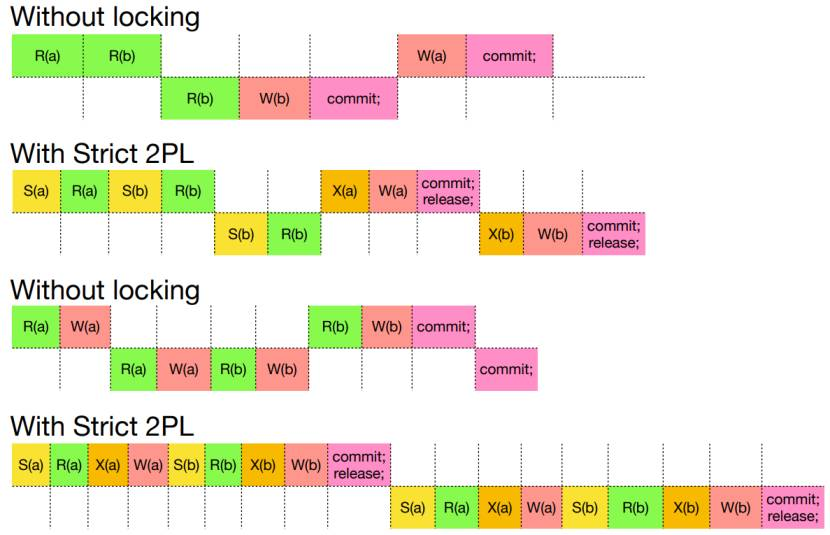

# Transactions

Transactions are ATOMIC programs execute all instructions, or none

Transactions in databases should ACID:

- **Atomicity**: A transaction is atomic, meaning that either all instructions are carried out or none at all.

- **Consistency**: A transaction ensures that the database remains in a consistent state after execution.

- **Isolation**: Transactions should be isolated from each other, allowing us to reason about a transaction without considering other transactions.

- **Durability**: When a transaction is committed, its effects should persist, even in the event of a system crash.


**Commit** : State that changes will officially applied on database after set of instructions executed.
### Commit & Rollback:

- Until you commit, other users cannot see your actions
- Rollback ends current transaction and undoes any changes to the DB

In Sqlite3 commits will be done after each command automatically but can be written like:
```sql
BEGIN TRANSACTION;

UPDATE ...

COMMIT;
```
### Interleaving WR conflict

Reading uncommitted data is also called **Dirty Read** and the order of interleaving of tasks by DBMS is important to stop concurrent interleaving of a data where not commited before so the wrong final value will be commited.
- **Unrepeatable** Read: This occurs in a database when a transaction reads a row of data, another transaction updates the same row, and then the first transaction reads the same row again, getting different data. This inconsistency is because the data has changed between the two reads.

- **Overwriting**: Overwriting in the context of databases happens when one transaction writes data to a row that another transaction has already modified, effectively erasing the changes made by the second transaction.

- **Dirty Read**: A dirty read occurs when a transaction reads data that has been modified by another transaction but not yet committed. If the modifying transaction rolls back, the data read by the first transaction becomes invalid, leading to inconsistencies.
Summary of Interleaved anomalies


### Serializability

does not interleave the instructions of different transactions


## Precedence graphs (Checking for Conflicts)

A directed edge from a to b when b reads/writes to an object previously read/written to by a, a is uncommitted, and one or both of the actions is a write


### 2PL (2 Phase locking) Protocol

S(a): Allows multiple transactions to read item 'a' concurrently, but prevents any transaction from writing to 'a' until all shared locks are released.

X(a): Grants exclusive access to item 'a' for a single transaction, preventing any other transaction from reading or writing to 'a' until the exclusive lock is released.


## Deadlock
### Prevention

Deadlock Prevention with Timestamps: This strategy assigns priorities to transactions based on their timestamps. If a transaction (Tx1) wants a lock held by another transaction (Tx2), Tx2 will abort if Tx1 has a higher priority. Otherwise, Tx1 waits. When a transaction restarts, it retains its original timestamp.

Alternatives to Strict 2PL:
- Conservative 2PL: This approach acquires all locks at the beginning of a transaction and releases them at the end. It ensures conflict serializability and prevents deadlocks but is not very efficient due to limited concurrency.
- Simple 2PL: Locks are acquired immediately before an action and released immediately after the object is no longer needed. It's time-efficient with high concurrency but may require cascading aborts, violating ACID properties.
- Optimistic Scheduling: Transactions do not lock objects. Instead, conflict serializability is checked through a precedence graph, and transactions may be rolled back and rescheduled when conflicts occur. It's efficient for mostly independent transactions but can become inefficient with concurrent processing of the same objects.

Advantages and Disadvantages:
- Conservative 2PL: Ensures conflict serializability and prevents deadlocks but lacks concurrency.
- Simple 2PL: Offers high concurrency and conflict serializability but may violate ACID properties during rollback.
- Optimistic Scheduling: Efficient for independent transactions but can be inefficient with concurrent processing and detecting conflicts.

## Checkpoint

A checkpoint in database management is like a backup of the database's consistent state after unexpected crashes. Before creating a checkpoint, Aall transactions must be completed. DBMS uses a write-ahead log to record all write operations before they're committed to the database.