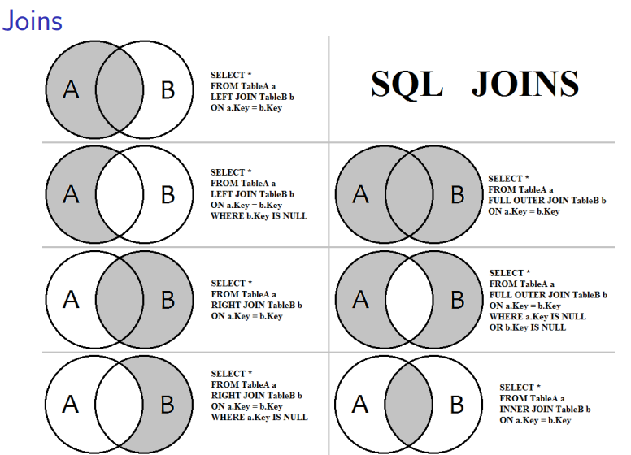

# SQL Queries with NULL, Updates, Triggers, and Views
### Inner Join
```sql
SELECT column_name(s) -- from both tables
FROM table1
INNER JOIN table2
ON table1.column_name = table2.column_name;
```
### Left Join
Returns all records from the left table (table1), and the matching records from the right table (table2)
```sql
SELECT column_name(s)
FROM table1
LEFT JOIN table2
ON table1.column_name = table2.column_name;
```
Note: The **LEFT JOIN** keyword returns all records from the left table , even if there are no matches in the right tabl but with NULL values.

<hr>
### Check
Set restrictions once table will be created
eg.
```sql
CREATE TABLE products (
        product_id INTEGER PRIMARY KEY,
        product_name TEXT NOT NULL,
        list_price REAL NOT NULL,
        discount REAL NOT NULL,
        -- Check whether discount is smaller list_price
    CHECK (list_price >= discount AND
        discount >= 0 AND
        list_price >= 0) );
INSERT INTO products VALUES (1, "CHOCOMEL", 0.9,0.8);
```
### Default value
```sql
CREATE TABLE employees (
    employee_id INTEGER PRIMARY KEY,
    employee_name TEXT NOT NULL,
    status TEXT DEFAULT 'active'
);

```
### Delete & Update
```sql
-- DELETE rows that meet qualification:
DELETE [FROM] table_name
 [WHERE qualification];
```
```sql
-- UPDATE rows that meet qualification:
UPDATE table_name
SET column1 = value1, column2 = value2...., columnN =valueN
[WHERE qualification];
-- eg.
UPDATE students
SET age = 17, grade = 11
WHERE student_name = 'Charlie';
```
## Batch Insertions

```sql
INSERT INTO ’tablename’ (
    ’column1’, ’column2’)
    VALUES(’data1’, ’data2’),
    (’data3’, ’data4’),
    (’data5’, ’data6’),
    (’data7’, ’data8’);
```
#### Insert using SELECT

```sql
INSERT INTO destinationTable (risposta, data_ins)
SELECT STATUS risposta, DATETIME(’now’) data_ins
    FROM  sourceTable
                                                                                  ```
## Triger

```sql
CREATE TRIGGER [IF NOT EXISTS] trigger_name
    [BEFORE|AFTER|INSTEAD OF] [INSERT|UPDATE|DELETE]
    ON table_name[WHEN condition]
  BEGIN
   statements;
END;

```
## Creating a view
Views look like tables, but are computed and updated fromexisting data
```sql
CREATE VIEW view_name [(column-name-list)] AS select-statement;

EG.
CREATE VIEW ProductsRBL AS
SELECT pid, priceRBL = priceEUR*120 AS priceRBL
FROM Products;
```
## SQLite Schema Table
```sql
CREATE TABLE sqlite_schema(
type text, /* "Table", "Index","Trigger", or "View"*/
name text,  /* Name of Trigger, View, Index, etc. */
tbl_name text, /* Name of Table on which object isdefined */
rootpage integer, /*rootpage, internal to SQLite*/
sql text ); /* The SQL statement, which would createthis table. *
```