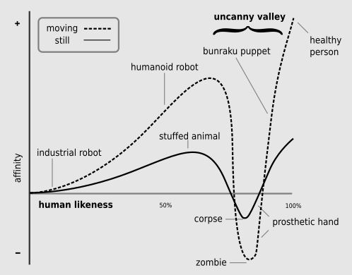

- **Frankenstein approach** builds robots by focusing on technology first, then adding appearance and social features at the end, Book critiques this approach as being suboptimal. So outside-in suggested where the design process begins by considering the intended interaction and user experience before integrating the technology.

- **Morphology** focuses on the **practical design** of a robot's structure based on what tasks it needs to perform, prioritizing function over appearance.
  
- **Anthropomorphism** emphasizes giving robots **human-like features** or behavior, focusing more on how humans will perceive and interact with the robot socially.

These approaches can sometimes overlap but are distinct: a robot can have a functional form (morphology) without being humanlike (anthropomorphism), or it can have human traits for interaction while still maintaining a functional design.

- Pareidolia: Pareidolia is seeing humanlike features in random objects, like a face on Mars.

- **The Uncanny Valley**: A theory suggesting that robots that are almost human-like but not quite can be disturbing to people.

---

### Key Design Principles in HRI:
- **Form and Function**: The shape (morphology) of a robot should match its intended function.
- **Affordances**: These are features that signal how a robot can be used (Eyes -> robot can see).
- **Design Patterns**: Reusable solutions to common problems in HRI design, such as communication patterns, can be applied across different robot designs.
    - **Underpromise and Overdeliver**: Set realistic expectations to avoid disappointment; don’t overhype a robot’s abilities.
    - **Interaction Expands Function**: `Open-ended` design allows users to adapt the robot to their own needs and expectations.
    - **Do Not Mix Metaphors**: Keep design consistent—appearance and behavior should align to avoid discomfort or confusion.

### **Design Methods**
- **Engineering Design Process**: This method focuses on technical problem-solving through simulations and modeling. It's effective but limited in open-ended or social contexts.
- **User-Centered Design (UCD)**: Involves users in the design process to ensure robots meet their needs and preferences. Testing prototypes early and often helps refine the design.
- **Participatory Design**: A more collaborative approach where users help co-create the robot design from the beginning. This is important for designing robots for specific groups, like elderly care.

### **Prototyping Tools (Section 4.4):**
- **Rapid Prototyping**: Tools like **LEGO Mindstorms**, **Arduino**, and **Raspberry Pi** make it easier to quickly build and test robot prototypes.
- These tools allow designers to test different concepts, gather feedback, and refine their designs.

### **Ethics and Values in Robot Design:**
- The Metaphysics of Quality: The connection between the robot and its designer is far deeper than you may assume.
- Value-sensitive design (VSD) is an approach that incorporates ethical considerations and user values into the design process.