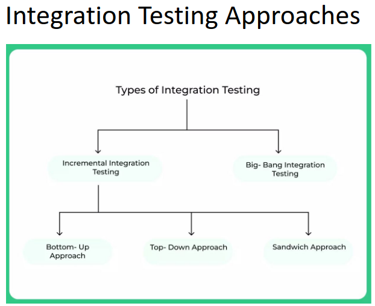
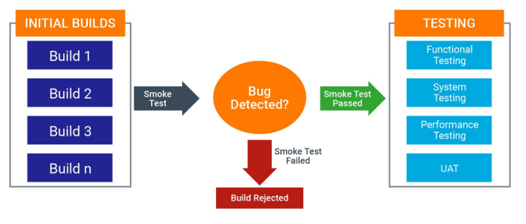

1. **Mutation Testing**
   - A white-box testing technique.
   - Arbitrary changes (mutations) are made to the program.
   - Changes produce a **mutant** program.
     - If the test suite detects the mutation, the mutant is considered **dead**.
     - If undetected, the test suite needs improvement.
   - **Types**:
     1. **Value Mutations**: Change numerical values.
     2. **Decision Mutations**: Change logical or arithmetic operators.
     3. **Statement Mutations**: Modify or delete statements.

2. **Integration Testing**
   - Ensures modules interact correctly by testing their interfaces.
   - **Approaches**:
     - **Big-bang**: All modules integrated at once (useful for small systems).
     - **Incremental**: Modules are integrated incrementally.
       - **Top-down**: Higher-level modules are integrated first.
       - **Bottom-up**: Lower-level modules are integrated first.
       - **Mixed (Sandwich)**: Combines top-down and bottom-up approaches.



#### **Smoke Testing**
- Also known as "Build Verification Testing."
- Ensures the critical functionalities of the software work.
- **Process**:
  1. Build is created.
  2. Smoke testing is performed:
     - Pass: Sent for further testing.
     - Fail: Rejected for fixes.
- Focused on quick checks for severe issues before extensive testing.



#### **System Testing**
- Validates the entire system against the **SRS (Software Requirement Specification)**.
- Conducted after integration and before acceptance testing.
- **Types**:
  1. **Performance Testing**: Evaluates speed, stability, and reliability.
  2. **Load Testing**: Tests system behavior under expected loads.
  3. **Stress Testing**: Assesses robustness under extreme loads.
  4. **Scalability Testing**: Measures the ability to handle scaling user loads.

---

#### **Acceptance Testing**
- Conducted after system testing to ensure business requirements are met.
- **Types**:
  1. **Alpha Testing**: Performed internally by the development team.
  2. **Beta Testing**: Performed by selected external users.

---

### **Pytest: Basics**
- **Installation**:
  ```bash
  pip install -U pytest
  pytest --version
  ```
- **Create a Test**:
  ```python
  # test_sample.py
  def func(x):
      return x + 1

  def test_answer():
      assert func(3) == 5
  ```
  Run with `pytest` command.

- **Key Features**:
  - **Fixtures**: Set up dependencies for tests.
  - **Parameterized Tests**: Test multiple inputs and outputs.
  - **Exception Handling**: Verify that specific exceptions are raised.


### **Pytest Features**
1. **Fixtures**:
   - Reusable setups for tests.
   ```python
   @pytest.fixture
   def sample_fixture():
       return 42

   def test_with_fixture(sample_fixture):
       assert sample_fixture == 42
   ```
2. **Parameterized Tests**:
   - Run the same test with multiple inputs.
   ```python
   @pytest.mark.parametrize("a, b, expected", [(1, 2, 3), (2, 3, 5)])
   def test_addition(a, b, expected):
       assert a + b == expected
   ```
3. **Exception Handling**:
   - Test that a function raises an exception.
   ```python
   with pytest.raises(ValueError):
       int("invalid")
   ```
4. **Temporary Directories**:
   - Use `tmp_path` to create unique temporary directories during tests.
   ```python
   def test_temp_dir(tmp_path):
       file = tmp_path / "example.txt"
       file.write_text("content")
       assert file.read_text() == "content"
   ```
   

### **Good Practices in Testing**
1. **Group Tests in Classes**:
   - Organize related tests.
   ```python
   class TestMath:
       def test_add(self):
           assert 1 + 1 == 2

       def test_subtract(self):
           assert 2 - 1 == 1
   ```
2. **Assertion Introspection**:
   - Pytest provides detailed error reporting for failed assertions.
   ```python
   def test_fail():
       assert 4 == 5  # Output: AssertionError: assert 4 == 5
   ```
3. **Mark Test Attributes**:
   - Use `pytest.mark` to categorize tests.
   ```python
   @pytest.mark.slow
   def test_long_running():
       ...
   ```