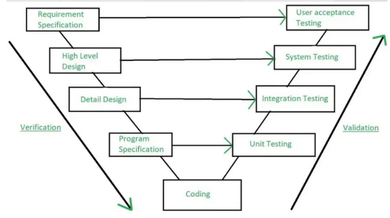
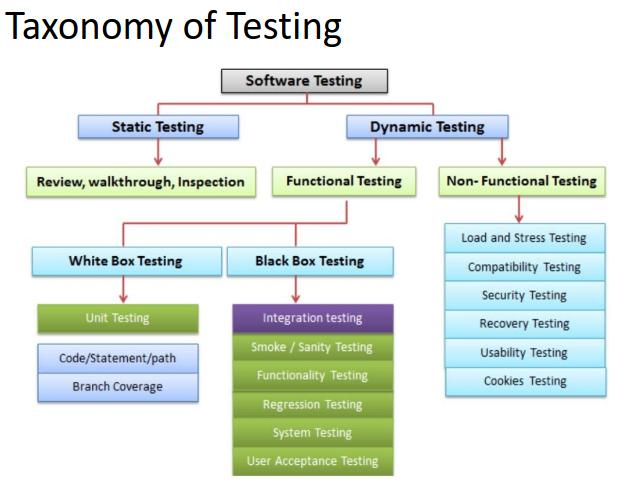

- **Test Case**: Input, state, and expected result ([I, S, R]).

**Verification vs. Validation**:
   - **Verification**: “Building the product right”
      - **Static Analysis**: Code inspection for errors.
         - Review: Manual code inspection.
         - Walkthrough: Detailed code review.
         - Inspection: Checklist-based review.
   - **Validation**: “Building the right product”
      - Dynamic testing: Executing code to find errors.
         - Black box: Input/output validation.
         - White box: Code coverage and logic testing.
            - **Coverage-based testing**:
               - **Statement Coverage**: Each statement executed
               - **Path Coverage**: Each path executed
            - Fault-based testing:
               - **Mutation Testing**: Introduce faults to test cases.
         - Gray box: Context-specific testing(White + Black).
   - 

**Debugging Approaches**:
- **Brute Force**: Insert print statements.
- **Backtracking**: Trace backwards from an error point.
- **Cause Elimination**: Test hypotheses for error causes.
- **Program Slicing**: Analyze variable dependencies.

#### **Unit Testing**
- Tests smallest units (functions, classes).
- Automated for consistency and coverage measurement.
- Code Coverage Metrics:
  - **Statement**
  - **Branch/Path**
  - **Condition**

- **Regression testing**: Verifies new changes don’t break existing functionality.
#### Cyclomatic Complexity (For Path Coverage)
- Formula: `M = E - N + 2P`
  - `M`: Cyclomatic complexity.
  - `E`: Number of edges.
  - `N`: Number of nodes.
  - `P`: Number of connected components.