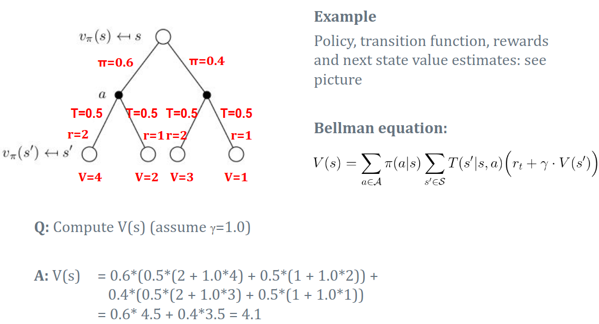

### **Dynamic Programming (DP)**

- **Goal**: Solve for optimal value function and policy.
- **Approaches**:
  - **Policy Iteration**:
    1. Evaluate policy until convergence.
    2. Improve policy.
  - **Value Iteration**:
    1. Partial policy evaluation (1 sweep).
    2. Policy improvement.
    3. Repeat until convergence.

The policy tells the robot which action to take in each state.  
For a deterministic policy, the robot always follows a fixed path (e.g., right → down).  
For a stochastic policy, the robot may take different actions probabilistically.

---

### Formula

$$
V^\pi(s) = \mathbb{E}_{\pi, T} \Bigg[ \sum_{i=0}^\infty \gamma^i r_{t+i} \,\Big|\, s_t = s \Bigg]
$$

---

### Explanation

- **$V^\pi(s)$** — Expected cumulative reward starting from state $s$ while following policy $\pi$.
- **$\mathbb{E}_{\pi, T}$** — Expectation over trajectories based on policy $\pi$ and transition $T$.
- **$\sum_{i=0}^\infty \gamma^i r_{t+i}$** — Sum of discounted rewards:
  - $\gamma$: Discount factor ($0 \leq \gamma \leq 1$).
  - $r_{t+i}$: Reward at time step $t+i$.
- The calculation starts at $s_t = s$.

---

### State and State-Action Values in MDPs

1. **State Value ($V(s)$)**

   **Formula:**
   $$
   V^\pi(s) = \mathbb{E}_{\pi, T} \Bigg[ \sum_{i=0}^\infty \gamma^i r_{t+i} \,\Big|\, s_t = s \Bigg]
   $$

2. **State-Action Value ($Q(s,a)$)**

   **Formula:**
   $$
   Q^\pi(s, a) = \mathbb{E}_{\pi, T} \Big[ r(s,a) + \gamma V^\pi(s') \Big]
   $$

---

### **Bellman Equation**

#### **State Value Function $V(s)$**

$$
V^\pi(s) = \sum_{a \in A} \pi(a|s) \sum_{s' \in S} T(s'|s,a)
\Big[ R(s,a,s') + \gamma V^\pi(s') \Big]
$$

#### **State-Action Value Function $Q(s,a)$**

$$
Q^\pi(s, a) = \sum_{s' \in S} T(s'|s,a)
\Big[ R(s,a,s') + \gamma \sum_{a' \in A} \pi(a'|s') Q^\pi(s',a') \Big]
$$

---

### **Backup Diagrams**

---

## Dynamic Programming

#### Key Idea

- Break a large problem into smaller subproblems.
- Efficiently store and reuse intermediate results.
- Repeatedly solving the small subproblem solves the overall problem.

In the context of MDPs: a central algorithm to solve for the **optimal policy**.

#### **Curse of Dimensionality**

- The number of states grows exponentially with the number of variables.
- Example:
  - Tic-tac-toe (3×3 board): $3^9 = 19{,}683$ states.
  - 4×4 board: $3^{16} = 43{,}046{,}721$ states.
- Results in high memory and computational needs.

---

### **Differences Between Policy Iteration, Value Iteration, and Q-Value Iteration**

| **Aspect** | **Policy Iteration** | **Value Iteration** | **Q-Value Iteration** |
|-------------|----------------------|----------------------|------------------------|
| **Goal** | Find the **optimal policy** $\pi^*$. | Find the **optimal value function** $V^*(s)$. | Find the **optimal state-action value** $Q^*(s,a)$. |
| **Representation** | Keeps a policy $\pi(a|s)$. | Derives policy from $V(s)$. | Derives policy from $Q(s,a)$. |
| **Evaluation Step** | Full policy evaluation (until convergence). | Partial evaluation (1 iteration per cycle). | Updates $Q(s,a)$ for all pairs each step. |
| **Improvement Step** | Improves policy after evaluation. | Combines evaluation + improvement. | Uses Bellman optimality directly. |
| **Formula Used** | Bellman equation for $V(s)$. | Bellman optimality for $V(s)$. | Bellman optimality for $Q(s,a)$. |
| **Complexity** | Higher per iteration, fewer total iterations. | Faster per iteration, more iterations. | Most expensive (operates in action space). |
| **Output** | $\pi^*(a|s)$. | $V^*(s)$. | $Q^*(s,a)$. |
| **Usage** | Best for small state spaces. | Works for large ones with few actions. | Best when actions matter most. |

---

- **Policy Iteration** → slower per step but fewer total steps.  
- **Value Iteration** → faster per step, needs more steps.  
- **Q-Value Iteration** → costlier (updates all state-action pairs).
